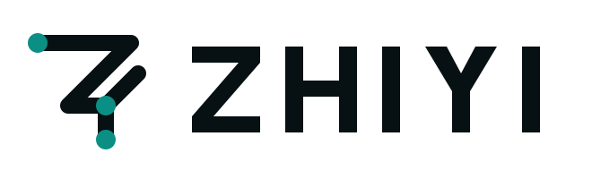
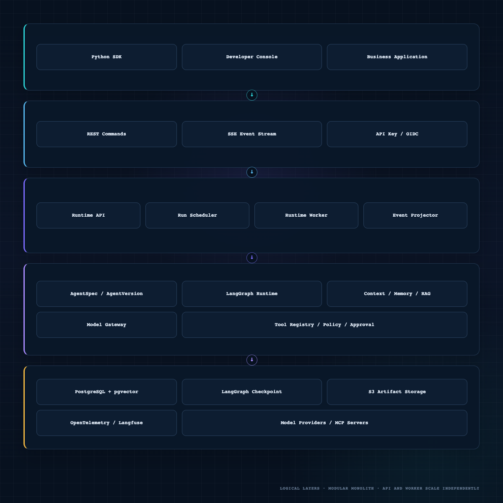

<h1 align="center">
  <picture>
    <source media="(prefers-color-scheme: dark)" srcset="./assets/brand/zhiyi-logo-dark.svg">
    <source media="(prefers-color-scheme: light)" srcset="./assets/brand/zhiyi-logo-light.svg">
    
  </picture>
</h1>

---

<a id="overview"></a>

## Overview

> [!IMPORTANT]
> ZHIYI is currently in the **design baseline and engineering governance phase**.
> The repository includes the product design, Spec Kit SDD workflow, design-drift
> checks, Git hooks, and CI. The product runtime, API, SDK, and console have not
> entered implementation. This README describes approved design goals, not
> currently available runtime capabilities.

ZHIYI is a self-hosted agent runtime platform for agent developers and platform
teams. It goes beyond demonstration-level tool calling by providing a stable
execution foundation for long-running agent tasks that involve external side
effects and require recovery and auditing.

| Repository area | Status |
|---|:---:|
| Product value, requirements, functional design, and technical design | Baselined |
| Spec Kit, design-drift checks, Git/Claude hooks, and CI | Established |
| Official website and documentation portal | Local static build complete; not deployed |
| Runtime, REST/SSE, worker, and checkpointing | Planned for M0 |
| Context, memory, RAG, tool approvals, and Langfuse | Planned for M1 |
| MCP, subagents, OIDC/RBAC, Helm, and production gates | Planned for M2 |

<a id="why-zhiyi"></a>

## Design Goals and Differentiators

The following differentiators are the project's **design direction** and will
be validated incrementally across M0–M2:

- **Recoverable execution:** Persistent asynchronous runs, checkpoints, leases,
  and explicit terminal states replace unrecoverable loops confined to a single
  request.
- **Governed side effects:** Every tool passes through a registry, schema
  validation, policy checks, approval, and idempotency controls. Unknown outcomes
  require human resolution.
- **Trustworthy context:** Context, memory, and RAG follow a fixed trust order,
  permission filters, provenance tracking, and lifecycle policies.
- **Verifiable quality:** Stable domain contracts isolate framework changes,
  while events, traces, metrics, and continuous evaluation verify runtime
  behavior.

<a id="capabilities"></a>

## Core Capabilities

The following items are approved design scope, not delivered capabilities:

- **Recoverable runtime:** Code-first `AgentSpec`, immutable `AgentVersion`,
  persistent runs, budgets, cancellation, checkpoints, SSE, and a stable
  `RunResult`.
- **Governed intelligence:** Model capability validation, context manifests,
  short-term summarization, long-term memory policy, permission-aware RAG,
  citations, and artifacts.
- **Safe tool execution:** Registry, schemas, policy, approval, idempotency,
  timeouts, result limits, unknown-outcome handling, and MCP adapters.
- **Quality and operations:** OpenTelemetry, Langfuse, continuous evaluation,
  multi-tenancy, least privilege, data governance, Helm, and reversible releases.

<a id="architecture"></a>

## Architecture

ZHIYI starts as a modular monolith with separate API and worker processes that
share a domain model and PostgreSQL. LangGraph provides execution recovery, the
product database stores business facts, and Langfuse is used only for
observability and evaluation.

<p align="center">
  
</p>

| Component | Responsibility boundary |
|---|---|
| **ZHIYI Domain** | Owns the semantics of tenants, agents, runs, tools, approvals, memory, artifacts, and events |
| **LangGraph** | Provides graph execution, checkpoints, interrupts, and recovery; it is not the source of business truth |
| **LangChain** | Adapts models, messages, tool schemas, structured output, and the provider ecosystem |
| **Langfuse** | Provides traces, prompt experiments, and evaluations; an outage must not affect run correctness |
| **PostgreSQL** | Stores product facts, the run queue, events, leases, and vector data |

See the [technical design](./doc/技术方案.md) for the complete architecture.

<a id="roadmap"></a>

## Roadmap

- **Governance baseline (current):** Establish authoritative design sources and
  SDD gates, with passing Spec Kit, hook, drift-check, and CI evidence as exit
  criteria.
- **M0 · Runtime Alpha:** Prove that the agent loop can execute and recover
  reliably. Validate worker failure recovery, SSE resumption, budget termination,
  and the run state machine.
- **M1 · Platform Beta:** Complete the enterprise knowledge-and-operations agent
  flow, including RAG, memory, approved write tools, Langfuse, and a minimal
  console.
- **M2 · Production V1:** Meet production deployment and governance requirements,
  including SLOs, upgrade compatibility, security auditing, backup and recovery,
  and rollback exercises.

See [PROJECT.md](./doc/PROJECT.md) for milestone scope, risks, and approved
decisions.

<a id="documentation"></a>

## Documentation

### Start Here

- [Product Value](./doc/产品价值.md): Why ZHIYI should exist, who it serves, and
  how its value will be validated.
- [Project Status and Roadmap](./doc/PROJECT.md): Current status, milestone scope,
  risks, and approved decisions.

### Evaluate the Product and Architecture

- [Requirements](./doc/需求文档.md): Product scope, functional and non-functional
  requirements, and acceptance criteria.
- [Functional Design](./doc/功能文档.md): User flows, object behavior, and
  functional boundaries.
- [Technical Design](./doc/技术方案.md): Architecture, state, data, reliability,
  security, and deployment design.

### Contribute to Design and Development

- [SDD Development Guide](./doc/SDD开发规范.md): Spec Kit, design drift, hooks,
  and CI procedures.
- [Repository Agent Rules](./AGENTS.md): Mandatory entry point for AI coding
  tools.
- [Detailed Agent Guidelines](./doc/AGENTS.md): Engineering, architecture,
  testing, security, and completion standards.

<a id="official-docs-site"></a>

## Official Website and Documentation Portal

`apps/docs/` contains the Astro + Starlight static website and documentation
portal. An explicit allowlist loads the seven `doc/*.md` sources directly,
without copying or rewriting their bodies. The build validates routes, internal
links, anchors, the Pagefind search index, responsive layouts, keyboard access,
light and dark themes, accessibility, and Lighthouse thresholds.

```bash
corepack enable
corepack install --global pnpm@11.22.0
pnpm --dir apps/docs install --frozen-lockfile
pnpm --dir apps/docs exec playwright install chromium
pnpm --dir apps/docs dev
```

Production build and full quality checks:

```bash
pnpm --dir apps/docs build
pnpm --dir apps/docs test:e2e
pnpm --dir apps/docs quality
```

Only local builds are currently supported. The repository contains no deployment
command, public domain, or analytics tracking. A public site requires explicit
approval through a separate Spec Kit feature and a real `SITE_URL` before
implementation.

<a id="development"></a>

## Contributing to Design and Development

Contributions are currently welcome for product documentation, Spec Kit
artifacts, architecture reviews, and governance tooling. The product runtime has
not been approved for implementation; all product code must pass the design gates
for its feature and receive explicit approval first.

The repository does not yet provide product installation or startup commands.
After cloning the repository for documentation or governance work, install the
versioned Git hooks:

```bash
git clone https://github.com/liuyuhui2020/ZHIYI.git
cd ZHIYI
./scripts/sdd/install_hooks.sh
```

Before any product implementation begins:

1. Read this README, [PROJECT.md](./doc/PROJECT.md), and the core product documents.
2. Resolve the outstanding decisions for the relevant M0 scope.
3. Create a separate feature with `$speckit-specify`.
4. Complete `spec → plan → tasks → analyze` and establish failing tests.
5. Complete `drift-report.md` and pass the local design-drift check.
6. Obtain explicit approval to enter implementation before running
   `$speckit-implement`.

```bash
python3 scripts/sdd/check_design_drift.py --worktree --gate manual
python3 -m unittest discover -s scripts/sdd/tests -v
```

> [!CAUTION]
> Do not use `--no-verify`, weaken CI, bypass Spec Kit, or suppress genuine
> design drift with a fabricated `ALIGNED` report.

## License and Public Status

The project is currently private and in the design phase; a license has not yet
been selected. Until a license is formally adopted, do not treat repository
content as authorized open-source software or publicly distribute restricted
third-party code.

---

<div align="center">
  <sub>Reliable agent execution, beyond the demo.</sub>
</div>
