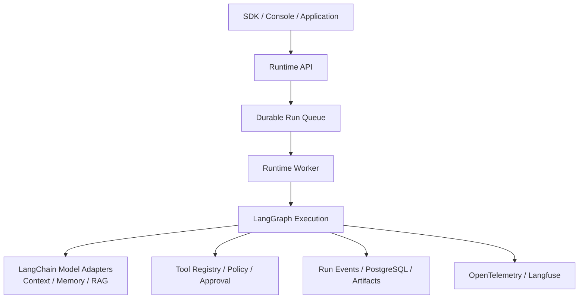

<div align="center">
  <h1>ZHIYI</h1>
  <p><strong>Designing a production-grade Agent Runtime Platform for the LangChain ecosystem</strong></p>
  <p>面向 Agent 开发者与平台团队，让长时运行任务可恢复、可约束、可审批、可审计、可持续评测。</p>
  <p><strong>当前处于方案基线与工程治理阶段，产品 Runtime 尚未实现。</strong></p>
  <p>
    <a href="./doc/PROJECT.md"><strong>查看当前状态与路线图</strong></a> ·
    <a href="./doc/技术方案.md">阅读技术架构</a>
  </p>
  <p>
    <a href="https://github.com/liuyuhui2020/ZHIYI/actions/workflows/sdd-governance.yml">
      
    </a>
    
    
    
  </p>
</div>

<p align="center">
  <a href="#overview">项目概览</a> ·
  <a href="#why-zhiyi">设计目标</a> ·
  <a href="#capabilities">核心能力</a> ·
  <a href="#architecture">架构</a> ·
  <a href="#roadmap">路线图</a> ·
  <a href="#documentation">文档</a> ·
  <a href="#development">参与设计与开发</a>
</p>

---

<a id="overview"></a>

## 项目概览

> [!IMPORTANT]
> ZHIYI 当前处于**方案基线与工程治理阶段**。仓库已经建立产品设计、
> Spec Kit SDD、设计漂移检查、Git Hooks 和 CI，但产品 Runtime、API、
> SDK 与控制台尚未开始实现。本文描述的是已确认设计目标，不代表现有可运行能力。

ZHIYI 面向 Agent 开发者和平台团队，目标是建设自托管的 Agent Runtime
Platform。它不以演示 Tool Calling 为终点，而是为长时间运行、存在外部副作用、
需要恢复和审计的 Agent 任务设计稳定执行底座。

| 当前仓库内容 | 状态 |
|---|:---:|
| 产品价值、需求、功能和技术方案 | 已建立基线 |
| Spec Kit、设计漂移检查、Git/Claude Hooks、CI | 已建立 |
| Runtime、REST/SSE、Worker、Checkpoint | M0 计划 |
| Context、Memory、RAG、Tool 审批、Langfuse | M1 计划 |
| MCP、Subagent、OIDC/RBAC、Helm、生产门禁 | M2 计划 |

<a id="why-zhiyi"></a>

## 设计目标与差异

以下差异是项目的**设计方向**，将在 M0–M2 按阶段验证：

- **持久执行：** 从单次请求内循环，演进为持久异步 Run、Checkpoint、租约和故障恢复。
- **Tool 安全：** 从模型直接调用，演进为 Registry、Schema、Policy、审批、幂等和结果查询。
- **上下文治理：** 从简单拼接 Prompt，演进为固定信任顺序、Context Engine 和 Context Manifest。
- **受控 Memory：** 不默认永久保存完整对话，而是通过 Policy、来源追踪、TTL、敏感分级和删除路径治理。
- **可信 RAG：** 不只返回相关文本，还提供权限过滤、文档版本、Provenance 和 Citation。
- **明确可靠性：** 失败、取消、超限和未知副作用都有明确状态、有限重试、恢复或人工处理路径。
- **可观测与评测：** 从打印日志，演进为 Run/Step/Model/Tool Trace、指标、事件和持续评测。
- **可替换框架边界：** 领域语义归产品所有，LangChain 与 LangGraph 通过边界适配而不是成为公共契约。

<a id="capabilities"></a>

## 核心能力

以下均为已确认的设计范围，不代表已交付能力：

- **Agent Runtime：** Code-first AgentSpec、不可变 AgentVersion、持久 Run、预算、取消和恢复。
- **Model Gateway：** 能力校验、Structured Output、受控 Fallback、Token 与成本核算。
- **Context & Memory：** 场景化上下文装配、Manifest、短期摘要和受治理长期记忆。
- **RAG & Artifact：** pgvector 检索、权限过滤、Citation、S3 Artifact 和文档解析。
- **Tool Execution：** Tool Registry、Policy、审批、幂等、超时、结果限制和 MCP 适配。
- **Events & API：** REST Command、持久 RunEvent、SSE 断线续传和稳定 RunResult。
- **Quality & Observability：** OpenTelemetry、Langfuse、数据集评测和 AgentVersion 发布门禁。
- **Security & Operations：** 多租户、最小权限、脱敏、留存、OIDC/RBAC、Helm 和回滚。

<a id="architecture"></a>

## 架构

ZHIYI 采用模块化单体起步，API 与 Worker 独立进程，共享领域模型和
PostgreSQL。LangGraph 负责执行恢复，产品数据库保存业务事实，Langfuse
只负责观测和评测。



| 组件 | 责任边界 |
|---|---|
| **ZHIYI Domain** | 拥有 Tenant、Agent、Run、Tool、Approval、Memory、Artifact 和 Event 语义 |
| **LangGraph** | Graph 执行、Checkpoint、Interrupt 和恢复，不是业务事实源 |
| **LangChain** | 模型、消息、Tool Schema、Structured Output 和 Provider 生态适配 |
| **Langfuse** | Trace、Prompt 实验和评测；不可用时不得影响 Run 正确性 |
| **PostgreSQL** | 产品业务事实、Run 队列、事件、租约和向量数据 |

完整设计见 [技术方案](./doc/技术方案.md)。

<a id="roadmap"></a>

## 路线图

- **治理基线（当前）：** 建立方案事实源与 SDD 门禁；以 Spec Kit、Hooks、漂移检查和 CI 通过为退出标准。
- **M0 · Runtime Alpha：** 证明 Agent Loop 可可靠执行和恢复；验证 Worker 故障恢复、SSE 续传、预算终止和状态机。
- **M1 · Platform Beta：** 跑通企业知识与操作 Agent；形成 RAG、Memory、审批写 Tool、Langfuse 和最小控制台闭环。
- **M2 · Production V1：** 满足生产部署与治理要求；完成 SLO、升级兼容、安全审计、备份恢复和回滚演练。

阶段范围、风险和已确认决策见 [PROJECT.md](./doc/PROJECT.md)。

<a id="documentation"></a>

## 文档导航

### 快速了解

- [产品价值](./doc/产品价值.md)：为什么做、为谁创造价值、如何验证价值。
- [项目说明与路线图](./doc/PROJECT.md)：当前状态、阶段范围、风险和已确认决策。

### 评估产品与技术

- [需求文档](./doc/需求文档.md)：产品范围、功能要求、非功能目标和验收标准。
- [功能文档](./doc/功能文档.md)：用户流程、对象行为和功能边界。
- [技术方案](./doc/技术方案.md)：架构、状态、数据、可靠性、安全和部署设计。

### 参与设计与开发

- [SDD 开发规范](./doc/SDD开发规范.md)：Spec Kit、设计漂移、Hooks 和 CI 操作流程。
- [仓库 Agent 规则](./AGENTS.md)：AI 编程工具必须读取的强制入口。
- [详细 Agent 工作规范](./doc/AGENTS.md)：工程、架构、测试、安全与完成标准。

<a id="development"></a>

## 参与设计与开发

当前可参与产品文档、Spec Kit 工件、架构评审和治理工具改进。产品 Runtime
仍未获准进入实现，任何产品代码必须先完成对应 Feature 的设计门禁并获得明确批准。

当前仓库尚无产品安装和启动命令。参与文档与治理工作时，首次克隆后安装版本化
Git Hooks：

```bash
git clone https://github.com/liuyuhui2020/ZHIYI.git
cd ZHIYI
./scripts/sdd/install_hooks.sh
```

任何产品实现开始前必须：

1. 阅读本 README、[PROJECT.md](./doc/PROJECT.md) 和核心产品文档。
2. 解决 M0 对应的待确认事项。
3. 使用 `$speckit-specify` 创建独立 Feature。
4. 完成 `spec → plan → tasks → analyze` 并建立失败测试。
5. 填写 `drift-report.md`，通过本地设计漂移检查。
6. 获得明确的“进入实现”批准后再运行 `$speckit-implement`。

```bash
python3 scripts/sdd/check_design_drift.py --worktree --gate manual
python3 -m unittest discover -s scripts/sdd/tests -v
```

> [!CAUTION]
> 不得使用 `--no-verify`、削弱 CI、绕过 Spec Kit，或通过伪造
> `ALIGNED` 报告压制真实设计漂移。

## 许可证与公开状态

项目目前为私有方案阶段，许可证尚未确定。在许可证正式选定前，不应将仓库
内容视为已授权的开源软件，也不应对外发布第三方受限代码。

---

<div align="center">
  <sub>Reliable Agent execution, beyond the demo.</sub>
</div>
