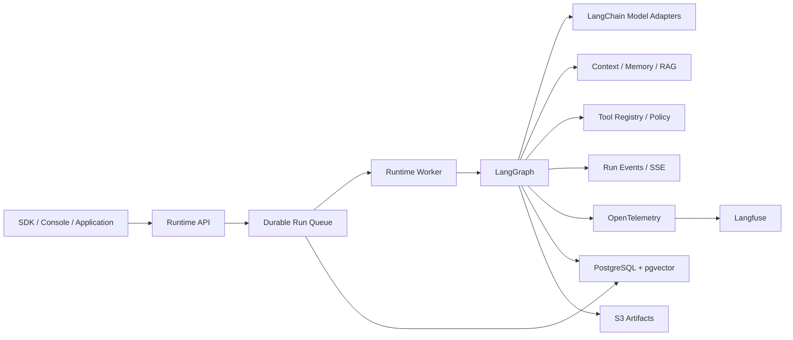

# ZHIYI Agent Runtime Platform

> 面向开发者、自托管、基于 LangChain 生态的生产级 Agent Runtime Platform。
> 当前状态：方案基线和 SDD 治理已建立，产品编码尚未开始。
> 文档版本：v0.1，2026-08-21。

ZHIYI 的目标不是再做一个只能演示 Tool Calling 的 Agent，而是提供稳定的运行平台，让 Agent 任务能够恢复、约束、审批、审计和持续评测。

## 项目定位

- **使用者：** Agent 开发者、平台运维人员、业务用户和审批人员。
- **交付形态：** 自托管 Runtime Service、Python SDK 和最小开发者控制台。
- **参考场景：** 企业知识与操作 Agent。
- **技术生态：** LangChain、LangGraph、Langfuse。
- **核心原则：** 产品拥有领域语义，框架负责可替换的基础能力。

## 核心能力

- Code-first AgentSpec 和不可变 AgentVersion。
- 持久异步 Run、Worker租约、Checkpoint和故障恢复。
- 模型能力校验、受控 Fallback、Token 和成本预算。
- 场景化 Context Engine 和可追踪 Context Manifest。
- 受 Memory Policy 管理的短期与长期记忆。
- 带权限、版本和 Citation 的 RAG。
- Tool Registry、Policy Engine、审批、幂等和 MCP 适配。
- Artifact、REST、SSE 断线续传和结构化 RunResult。
- Langfuse Trace、数据集评测和 AgentVersion发布门禁。
- 逻辑多租户、数据留存、脱敏和生产安全边界。

## 架构摘要

架构采用模块化单体：API 和 Worker 独立进程，共享领域模型和 PostgreSQL。LangGraph负责执行恢复，产品数据库保存业务事实，Langfuse只负责观测和评测。

完整说明见 [技术方案](./技术方案.md)。

## 文档导航

建议阅读顺序：

1. [产品价值](./产品价值.md)：理解为什么做、服务谁、如何验证价值。
2. [需求文档](./需求文档.md)：确认功能范围、非功能目标和验收标准。
3. [功能文档](./功能文档.md)：查看用户流程和具体功能行为。
4. [技术方案](./技术方案.md)：查看架构、状态、数据、可靠性和部署设计。
5. [PROJECT.md](./PROJECT.md)：查看当前状态、阶段、风险和已确认决策。
6. [SDD 开发规范](./SDD开发规范.md)：查看 Spec Kit、设计漂移和 Hook 门禁。
7. [AGENTS.md](./AGENTS.md)：后续编码 Agent 的工作规则。

## 技术栈

| 领域 | 计划选择 |
|---|---|
| Backend | Python 3.12、FastAPI、Pydantic v2 |
| Agent | LangChain v1、LangGraph |
| Persistence | PostgreSQL、SQLAlchemy 2、Alembic |
| Retrieval | pgvector |
| Artifact | S3 兼容对象存储 |
| Observability | OpenTelemetry、Langfuse |
| Console | React、TypeScript、Vite、TanStack Query |
| Local | Docker Compose |
| Production | OCI、Kubernetes、Helm |

具体依赖版本尚未锁定。开始 M0 时必须以兼容性验证结果生成 `uv.lock`，不能直接复制本文中的生态版本描述作为依赖约束。

## 交付路线

### M0 Runtime Alpha

建立可恢复 Agent Loop：AgentSpec、异步 Run、Fake Model、只读 Tool、PostgreSQL Checkpoint、REST/SSE、预算和故障恢复。

### M1 Platform Beta

跑通参考场景：OpenAI/Anthropic、Context、Memory、RAG、Citation、Artifact、审批、幂等写 Tool、Langfuse和最小控制台。

### M2 Production V1

满足生产门禁：MCP、受控 Subagent、OIDC/RBAC、AgentVersion兼容路由、评测门禁、Helm、压测、安全审计和回滚演练。

详细阶段退出标准见 [PROJECT.md](./PROJECT.md)。

## 当前仓库状态

当前仓库已有方案基线、官方 Spec Kit 基础设施、设计漂移检查器、Git/Claude
Hooks 和 CI 门禁，但没有可运行产品应用、产品依赖清单或数据库迁移。因此：

- 暂无安装和启动命令。
- 暂无可调用 API。
- 文档中的目录、类型和接口均为设计目标，不表示已经实现。
- `specs/001-sdd-governance/` 是首个生效的 Spec Kit feature。
- `openspec/changes/build-langchain-agent-platform/` 仅作为历史输入保留，不得
  作为新实现的事实源。

## 关键工程语义

- Run 是持久异步任务，同步 SDK 只是等待封装。
- AgentVersion 不可变，Run 永久绑定具体版本。
- Product Session 不等于 LangGraph Thread；独立 Run 使用独立线程。
- Tool 调度为 At-least-once，写操作依赖幂等和结果查询。
- 外部副作用结果未知时进入人工处理，不盲目重试。
- 长期 Memory 需要策略批准，不默认永久保存完整对话。
- 不保存或展示模型原始 Chain-of-Thought。
- Langfuse不可用不得影响 Run 正确性。

## 参与项目

当前仍处于方案阶段。任何实现工作开始前，应先：

1. 阅读全部 `doc/` 文档。
2. 解决 [PROJECT.md](./PROJECT.md) 中与 M0 有关的待确认事项。
3. 使用 `$speckit-specify` 为 M0 建立独立 Spec Kit feature。
4. 完成 `plan → tasks → analyze`，建立失败测试和验收计划。
5. 填写 `drift-report.md` 并通过本地设计漂移检查。
6. 获得明确的“进入实现”确认，再运行 `$speckit-implement`。

首次克隆后执行 `./scripts/sdd/install_hooks.sh`。后续开发必须遵守
[SDD 开发规范](./SDD开发规范.md)和 [AGENTS.md](./AGENTS.md)。

## 许可证

尚未选择。项目按可开源的模块边界设计，是否公开以及采用何种许可证将在 M1 验证后决定。在许可证确定前，不应对外发布或复制第三方受限代码。
