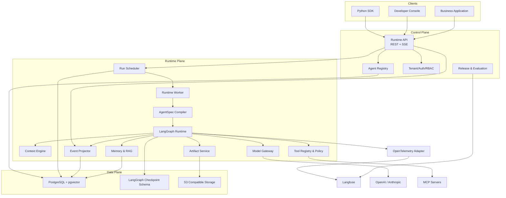
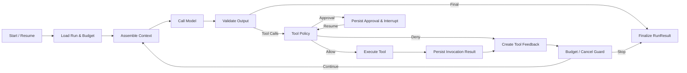
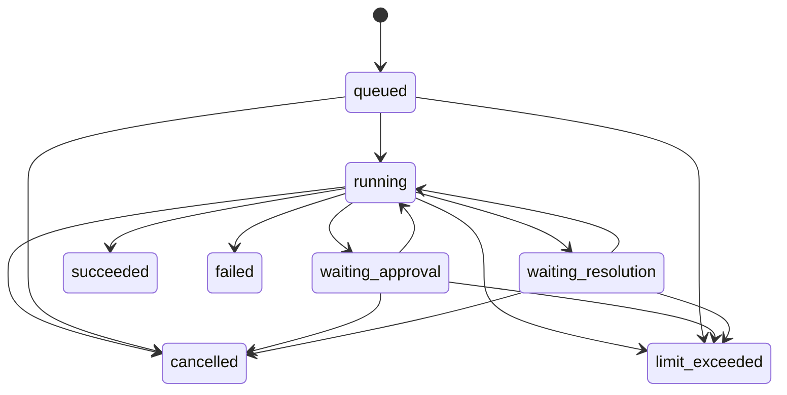

# ZHIYI Agent Runtime Platform 技术方案

> 状态：候选架构基线；Model Gateway 与 Run Lifecycle Kernel 已实现，完整 Runtime 尚未实现
> 版本：v0.1
> 更新日期：2026-08-24
> 关联文档：[需求文档](./需求文档.md) · [功能文档](./功能文档.md) · [项目计划](./PROJECT.md) · [Agent 工作规范](./AGENTS.md)

## 1. 方案结论

ZHIYI 采用模块化单体和六边形架构，以自研 Runtime Service 掌握产品领域语义，在内部嵌入 LangGraph OSS 作为图执行引擎，使用 LangChain 作为模型与 Tool 生态适配层，使用 Langfuse 作为可替换的 LLM 观测与评测出口。

核心边界：

- 产品拥有 Tenant、Agent、Session、Task、Run、Tool、Approval、Memory、Artifact 和事件语义。
- LangGraph拥有 StateGraph、Checkpoint、Interrupt、恢复和底层流式执行。
- LangChain拥有模型 Provider、Messages、Tool Schema、Structured Output 和 Callback 集成。
- Langfuse拥有 Trace、Prompt 实验、Dataset 和评分，但不参与运行正确性。
- PostgreSQL 是产品事实源；LangGraph Checkpoint 是执行恢复源，二者不得混用。

## 2. 设计目标

### 2.1 质量属性优先级

1. 正确性和副作用安全。
2. 故障恢复和明确终态。
3. 租户隔离和数据治理。
4. 可观测与可评测。
5. 可维护、可替换和可测试。
6. 性能和水平扩展。
7. 开发体验。

### 2.2 约束

- 新项目，不兼容旧实现和旧数据。
- Python 是唯一 Agent Runtime 语言。
- Runtime 可自托管，不依赖外部控制面。
- M0/M1 不对不可信用户开放动态代码执行。
- V1 不承诺外部副作用 Exactly-once。
- 首期避免 Redis、Kafka、Temporal 和独立向量数据库。

## 3. 总体架构



控制面和运行面是逻辑边界，首期仍在一个代码仓库和一个发布单元内。API 与 Worker 使用不同进程入口，可独立扩缩容。

## 4. 分层与依赖规则

### 4.1 逻辑层

| 层 | 职责 | 允许依赖 |
|---|---|---|
| domain | 领域实体、值对象、状态机、错误和端口 | Python 标准库、轻量类型库 |
| application | 用例、事务编排、策略协调 | domain |
| runtime | Graph 编译、节点、Worker 和恢复协调 | application、domain、端口 |
| adapters | LangChain、LangGraph、Langfuse、数据库、S3、MCP 实现 | 对应端口和第三方 SDK |
| api | FastAPI、OpenAPI、SSE、认证入口 | application、API Schema |
| infrastructure | 配置、迁移、日志、进程和部署 | adapters、api、runtime |

禁止事项：

- domain 导入 LangChain、LangGraph、Langfuse、FastAPI、SQLAlchemy 类型。
- Graph Node 直接操作 ORM Session 或发送未经 Tool Runtime 管理的副作用。
- API 返回 Provider 原始响应、LangGraph State 或 Checkpoint。
- Adapter 反向定义产品状态机。

### 4.2 建议目录

```text
src/zhiyi/
├── domain/
│   ├── agents/
│   ├── runs/
│   ├── tools/
│   ├── memory/
│   ├── artifacts/
│   └── events/
├── application/
│   ├── commands/
│   ├── queries/
│   ├── policies/
│   └── ports/
├── runtime/
│   ├── graph/
│   ├── nodes/
│   ├── worker/
│   └── projections/
├── adapters/
│   ├── models/
│   ├── tools/
│   ├── persistence/
│   ├── langfuse/
│   ├── mcp/
│   └── storage/
├── api/
│   ├── routes/
│   ├── schemas/
│   ├── auth/
│   └── sse/
└── infrastructure/
    ├── config/
    ├── logging/
    └── lifecycle/
```

这是设计目标，不表示目录已经创建。

## 5. Agent 定义与编译

### 5.1 AgentSpec

AgentSpec 是常规 Agent 的 Python 配置对象。它引用模型策略、Prompt、Tool、Context Policy、Memory Policy、预算和结果 Schema，不持有运行时连接或密钥。

`AgentSpecCompiler` 负责：

1. 解析不可变 AgentVersion。
2. 校验模型能力和 Tool 依赖。
3. 组装平台标准节点和中间件。
4. 生成 LangGraph StateGraph。
5. 注册事件转换和预算钩子。
6. 生成可复现的构建摘要。

### 5.2 自定义 StateGraph

自定义 Graph 通过 `GraphFactory` 端口接入。平台向其注入受控 RuntimeContext，自定义节点只能通过端口调用模型、Tool、Memory、Artifact 和事件服务。

### 5.3 AgentVersion 可恢复性

不可变版本不仅要记录配置，还必须保证旧代码可加载：

- AgentVersion 记录 Agent Package 和容器镜像摘要。
- Worker 声明自己支持的 AgentVersion 范围。
- 滚动升级期间旧 Worker 停止领取新版本，但继续处理已领取或等待恢复的旧版本。
- 等待审批必须有有效期，过期后按策略失败或重新评估。
- M2 需要版本路由和 N-1 兼容验证，不能只保存一个版本号就宣称可恢复。

## 6. Agent Runtime

### 6.1 标准 Graph



节点执行前后检查取消和预算。对外部副作用的调用必须封装为可识别、可幂等的 ToolInvocation，不能直接放在可能因 Interrupt 重新开始的节点前半段。

### 6.2 Graph State

Graph State 保持紧凑，只包含：

- Run、Task、Session 和 Graph Thread 标识。
- 经过约束的消息状态。
- Context Manifest 引用。
- 结构化 Plan。
- Tool Call 和 ToolResult 引用。
- Budget Snapshot。
- Approval/Interrupt 引用。
- RunResult 草稿和错误分类。

大 Tool 输出、文件和长检索内容通过 Artifact 或数据库引用传递。

### 6.3 Run 状态机



当前内核以不可变 Run 快照和单一转换表实现上述完整矩阵。每个 mutation 使用
expected_version；仓储先检查 tenant+command_id 的意图指纹，再执行版本 CAS，保证丢失
响应后的同意图重放返回原 receipt/event，不同意图复用稳定失败。每次实际变化同时增加
Run version 和连续 event sequence；终态只生成一次且不能重写。`waiting_resolution`
需要具有权限的 Operator 对未知 Tool 结果执行确认、补录或终止。

### 6.4 当前 Run Lifecycle Kernel 边界

已实现 `domain/runs` 值对象、状态机、Decimal 硬预算、deadline/时钟回退防护、不可变
RunResult 和版本化安全 RunEvent；application 层提供命令、Clock/IdentifierGenerator/
RunRepository 端口和生命周期编排；adapter 层提供异步锁保护的 copy-validate-swap
内存仓储。Run、事件与 CommandReceipt 在一次 commit 中全有或全无，跨租户读取统一
表现为不存在。

内存仓储仅用于本地执行和契约验证，不提供跨进程持久化、数据库事务、租约或恢复。
下一切片应让 PostgreSQL adapter 通过同一仓储契约，再建立领取租约、Worker 与
Checkpoint 协调；本切片不连接 Model Gateway、LangGraph、Tool、API 或 SSE。

## 7. 异步调度与租约

### 7.1 PostgreSQL 队列

Run 记录自身就是持久队列项。Worker 使用 `SELECT ... FOR UPDATE SKIP LOCKED` 原子领取可执行 Run，并写入：

- `worker_id`
- `lease_token`
- `lease_expires_at`
- `attempt_no`
- `heartbeat_at`

Worker 只在持有有效 lease_token 时更新运行状态。续租失败后必须停止启动新节点，避免双执行扩大。

### 7.2 回收

Reconciler 周期扫描过期租约：

- 有可用 Checkpoint：重新排队。
- 正在等待审批：保持等待，不占 Worker。
- Tool 结果未知：进入 `waiting_resolution`。
- 超过恢复次数：进入失败并保留诊断信息。

### 7.3 扩展阈值

满足下列任一条件时评估专用 Broker：

- 待处理 Run 长期超过 10,000。
- 领取 Run 的 p95 超过 200 ms。
- 队列与事件轮询占数据库负载超过 20%。
- 需要跨区域调度或不同优先级隔离。

在测量前不引入 Redis、Kafka 或 NATS。

## 8. 双持久化边界

### 8.1 产品数据库

产品数据库记录对用户和审计有意义的事实：Run 状态、Step、ToolInvocation、Approval、Event、Memory 和 Artifact 元数据。

### 8.2 LangGraph Checkpoint

Checkpoint 只用于恢复图状态。删除 Checkpoint 不能删除产品审计，回放产品 Event 也不能触发 Graph 执行。

### 8.3 一致性策略

产品事务和 LangGraph Checkpoint 不假设具备分布式原子事务：

- 每个节点和 ToolInvocation 使用稳定 step_key/idempotency_key。
- 产品状态更新采用幂等 upsert 或唯一约束。
- 事件通过产品事务写入，并以 Run 内 sequence 去重。
- Reconciler 对比 Run、租约、Checkpoint 和最后 Step，修复可判断的不一致。
- 无法判断外部副作用结果时不自动选择“成功”或“失败”。

## 9. Model Gateway

### 9.1 平台契约

领域和应用层使用平台定义的 ModelRequest、ModelResponse、ModelChunk、ModelUsage、ModelCapability 和 ModelError。LangChain Message 只存在于适配器内部。

当前实现位于 `src/zhiyi/application/{models,ports,services}` 与
`src/zhiyi/adapters/{models,secrets}`。ProviderId 是开放式受校验键；新增 Provider
实现 ModelProvider 并显式注册即可，不需要修改平台请求/响应契约。Model Gateway 当前
仍未接入 Agent Graph 或 Run Lifecycle Kernel，也不包含生产 Run 持久化、API、Worker、
Checkpoint、Langfuse 或 Tool 执行。

### 9.2 Provider 适配

已实现适配器使用专用的 `langchain-openai==1.6.0` 和
`langchain-anthropic==1.6.1`，共享边界使用 `langchain-core==1.6.0`，结构化结果最终
通过 `pydantic==2.13.4` 本地复验。依赖由 `uv.lock` 冻结，不引入
`langchain-community`；两个官方 SDK 的隐藏重试均关闭，由 Gateway 单点控制。

### 9.3 调用策略

- 每次调用设置总超时和流式空闲超时。
- 仅对超时、限流和临时 Provider 故障有限重试。
- Fallback 必须满足 Agent 所需能力。
- 统一记录 Provider 请求 ID、模型版本、Token、延迟、重试和成本。
- Structured Output 使用 Pydantic 校验，失败不返回未验证正文且不自动发起修复调用。
- 限流与 CLOSED/OPEN/HALF_OPEN 熔断状态按 `(provider, model_id)` 隔离；半开只允许一个探测。
- 流式首个可见文本或 Tool 增量后禁止重试/Fallback；提前关闭会释放底层异步迭代器。

LangChain 提供统一模型接口、Tool Calling 和 Structured Output，但 Provider 特有能力仍需能力档案和契约测试。[LangChain Models](https://docs.langchain.com/oss/python/langchain/models)

## 10. Context Engine

### 10.1 Context Provider

不同来源通过 ContextProvider 输出 ContextItem：

- PlatformPolicyProvider
- AgentPolicyProvider
- ScenarioProvider
- TaskProvider
- MemoryProvider
- RetrievalProvider
- ConversationProvider
- ToolResultProvider

### 10.2 预算算法

1. 从模型档案读取最大输入和输出能力。
2. 应用 AgentVersion 的更严格上限。
3. 预留输出、Tool Schema 和协议开销。
4. 强制加入不可裁剪平台策略。
5. 按优先级和可信等级选择其他项。
6. 对允许摘要的低优先级组执行摘要。
7. 生成 Manifest 并在调用后校正 Token 估算。

摘要本身是模型调用，必须计入预算和 Trace。摘要不能改变安全策略或将不可信内容升级为可信指令。

## 11. Memory 与 RAG

### 11.1 短期 Memory

短期 Memory 存在于 Graph Thread 和产品消息记录中。Graph Thread 不能直接等同于 Product Session，一个 Session 可以包含多个独立 Run。

### 11.2 长期 Memory

MemoryRecord 使用 `tenant_id + subject_id + agent_id + namespace` 作为作用域。写入流程为“模型提议 → Schema 校验 → Policy → 去重/冲突处理 → 持久化”。

检索必须过滤：

- 租户和主体权限。
- Agent 与命名空间。
- 过期和删除状态。
- 敏感级别与当前场景权限。
- 相关度和数量上限。

### 11.3 RAG

PostgreSQL保存 Document、DocumentVersion、Chunk、ACL 和解析状态，pgvector保存 Embedding。对象存储保存原文件和大文本。检索采用权限过滤与向量/关键词混合接口，具体排序算法在 M1 评测后决定。

## 12. Tool Runtime

### 12.1 ToolDescriptor

ToolDescriptor 必须具有：

- 稳定名称和语义版本。
- Pydantic 输入和输出 Schema。
- 风险、权限、副作用和并行属性。
- 超时、重试、并发和输出限制。
- 幂等能力与结果查询能力。
- 审计和 Trace 数据策略。

### 12.2 幂等执行

幂等键建议为：

```text
hash(tenant_id, run_id, tool_call_id, tool_name, tool_version)
```

执行前创建 ToolInvocation：

- 已成功：返回保存结果。
- 正在执行且租约有效：不重复执行。
- 失败且可安全重试：在次数范围内重试。
- 结果未知：等待人工处理。

### 12.3 MCP

MCP Adapter 把远程 Tool 映射为 ToolDescriptor。MCP Server 的发现、启用、连接、凭证和租户范围独立管理。MCP 传输对象不能进入 Graph State 或公共 API。[LangChain MCP](https://docs.langchain.com/oss/python/langchain/mcp)

## 13. Policy 与审批

Policy Engine 接收 Principal、Tenant、AgentVersion、ToolDescriptor、参数摘要、目标资源、敏感度和 Run Budget，返回 `allow`、`deny` 或 `require_approval`。

审批恢复规则：

- Approval 具有唯一 ID 和状态版本。
- 只有匹配权限和资源范围的 Principal 能处理。
- 重复提交相同决定幂等返回。
- 参数被编辑后重新校验和评估 Policy。
- Approval 过期后不得直接执行原请求。

LangChain 的 Human-in-the-loop Middleware 可以参考或适配，但平台 Policy 和 Approval 记录是产品事实源。[LangChain Human-in-the-loop](https://docs.langchain.com/oss/python/langchain/human-in-the-loop)

## 14. Artifact

Artifact 元数据存 PostgreSQL，内容存 S3 兼容存储。上传流程包括大小/MIME 校验、哈希、恶意内容检查接口、对象写入、解析和索引。下载通过短时签名地址或受控代理。

Graph State、Event 和 Trace 只保存 Artifact ID、摘要和受控预览，避免放大数据库、Checkpoint 和模型上下文。

## 15. API 与事件

### 15.1 API 原则

- 使用 `/v1` 版本前缀。
- Command 使用幂等请求键。
- 资源查询始终按 Tenant Context 过滤。
- 错误使用稳定 `error_code` 和关联 ID。
- 内部异常、SQL、密钥和 Provider 原始正文不得返回客户端。

具体路径和字段在实现阶段通过 OpenAPI 契约评审确定，本文不提前伪造可运行接口。

### 15.2 Event Envelope

稳定 Event 应包含：

- event_id
- run_id
- sequence
- type
- occurred_at
- payload_version
- payload

SSE 使用持久事件回放和 heartbeat。客户端必须按 sequence 或 event_id 去重。LangGraph Stream 通过 Event Projector 转换，绝不原样透传。

## 16. 可观测与评测

### 16.1 三类数据

- **日志：** 运行诊断，结构化且默认不含完整 Prompt。
- **指标：** 队列、租约、Run 终态、模型延迟、Tool、Token、成本和错误率。
- **Trace：** Run 内图节点、模型、Context、RAG、Memory 和 Tool 关系。

### 16.2 Langfuse

每个 Run Attempt 建立一个 Trace，Product Session ID 用于关联。Langfuse Adapter 通过 Callback 和手工 Span 采集 LangChain及平台步骤。SDK 后台队列失败时只记录限频告警，不阻塞 Run。[Langfuse LangChain Integration](https://langfuse.com/integrations/frameworks/langchain)

应用侧完成：

- 用户标识伪名化。
- Tool 和 Memory 敏感字段遮蔽。
- Prompt/输出按租户策略采样或省略。
- Trace、AgentVersion、PromptVersion、ToolVersion 和 DatasetVersion 关联。

### 16.3 评测门禁

评测至少覆盖：正确性、Citation、Tool 选择、Tool 参数、不应调用 Tool、Prompt Injection、越权、Context 超限、Memory 污染、延迟、Token 和成本。

Langfuse保存实验和 Score，平台 Release Service 决定 AgentVersion 是否可发布。[Langfuse Evaluation](https://langfuse.com/docs/evaluation/core-concepts)

## 17. 数据模型草案

首期主要表：

| 领域 | 表 |
|---|---|
| Tenant/Auth | tenants、principals、api_keys、role_bindings |
| Agent | agent_definitions、agent_versions、agent_tools、prompt_snapshots |
| Runtime | sessions、tasks、runs、run_steps、run_events、worker_leases |
| Tool | tool_definitions、tool_versions、tool_invocations、approvals |
| Context/Memory | context_manifests、memory_records、memory_changes |
| RAG | documents、document_versions、chunks、document_acl |
| Artifact | artifacts、artifact_grants |
| Evaluation | evaluation_runs、release_gates |

LangGraph Checkpoint 使用独立 Schema 和官方 Saver 所需表，不允许业务查询直接依赖其内部列。

所有租户资源的唯一约束和常用索引必须包含 `tenant_id`。高频 Event 索引至少覆盖 `(tenant_id, run_id, sequence)`。

## 18. 安全设计

### 18.1 身份和租户

- 每个请求解析为 TenantPrincipal。
- 开发环境使用配置型 API Key，生产使用 OIDC/RBAC Adapter。
- 对无权资源返回统一 Not Found，避免泄露存在性。
- 服务间身份和用户身份分开记录。

### 18.2 密钥

- 模型、MCP 和外部 Tool 凭证通过 Secret Provider 获取。
- 密钥不进入 AgentSpec、Graph State、Event、Artifact 或 Langfuse。
- 配置输出和错误日志必须执行 Secret Redaction。

### 18.3 Prompt Injection

- 检索、用户和 Tool 内容始终标记为数据而非平台指令。
- Tool 权限不因 Prompt 内容改变。
- 高风险操作由确定性 Policy 判断。
- 攻击测试进入版本发布门禁。

### 18.4 数据留存

- Run 恢复正文默认 30 天。
- 结构化审计默认 180 天。
- Artifact、Memory、Trace 分别配置 TTL。
- 删除任务异步执行并产生不包含原文的审计事件。

## 19. 部署架构

### 19.1 本地

Docker Compose 运行 API、Worker、PostgreSQL/pgvector、S3 兼容服务和可选 Langfuse。Fake Model 模式不需要真实 Provider 密钥。

### 19.2 生产

- API Deployment：无状态、多副本。
- Worker Deployment：按队列深度扩容。
- Reconciler：单活租约或领导者选举。
- 外部 PostgreSQL：备份、时间点恢复、连接池和监控。
- 外部对象存储。
- 可选自托管 Langfuse或 Langfuse Cloud。

数据库迁移为独立 Job，不能由每个应用实例启动时自动执行。滚动升级必须先验证 AgentVersion兼容范围。

## 20. SLO 与容量

| 指标 | 初始目标 |
|---|---|
| Runtime API 月可用性 | 99.9% |
| Worker 故障接管 | 30 秒内 |
| Event 交付额外延迟 | p95 < 500 ms |
| 单 Worker Pool 活跃 Run | 100 基线 |
| Run 永久卡住 | 0，必须由 Reconciler 处理 |
| 已确认幂等副作用重复 | 0 |

模型 Provider 的故障率单独统计，不能用平台可用性掩盖，也不能把第三方故障误报为平台成功。

## 21. 测试策略

### 21.1 单元测试

- 已覆盖 Run 状态机、四类终态、预算边界、deadline、取消、事件/结果脱敏和错误分类。
- Context 选择、Policy 和 Memory Policy 留待对应切片。
- 使用确定性 Fake Model，不依赖在线模型。

### 21.2 契约测试

- OpenAI/Anthropic 消息、Tool Calling、Structured Output、Usage 和错误映射已由离线双桩覆盖；付费在线冒烟默认跳过。
- RunRepository 契约已由内存适配器覆盖原子提交、幂等、租户隔离、分页与并发冲突；
  未来 PostgreSQL adapter 必须复用同一契约。
- LangGraph Checkpoint 和 Interrupt 恢复。
- Tool、MCP、S3 和 Langfuse Adapter。

### 21.3 集成测试

- PostgreSQL租约并发领取。
- API 创建 Run、Worker 执行、SSE 回放和终态查询。
- 审批暂停与恢复。
- Tool 幂等和 `outcome_unknown`。
- 跨租户访问拒绝。

### 21.4 故障注入

- 模型流式中断。
- Worker 在节点和 Tool 前后终止。
- PostgreSQL短时不可用。
- Langfuse、MCP 和对象存储不可用。
- SSE 客户端慢消费与重连。

### 21.5 评测与安全

- 固定数据集比较 AgentVersion。
- Prompt Injection、越权、敏感数据和 Tool 误调用。
- 延迟、Token、成本和100活跃 Run 基线。

## 22. 主要风险与缓解

| 风险 | 后果 | 缓解 |
|---|---|---|
| LangChain生态快速变化 | 升级破坏 Provider 行为 | 锁版本、适配器隔离、契约测试 |
| 产品记录与 Checkpoint 不一致 | Run 状态错误或重复步骤 | 幂等键、Reconciler、语义分离 |
| 写 Tool 结果未知 | 重复副作用或错误终态 | `waiting_resolution`、结果查询、人工处理 |
| 旧 AgentVersion 无法加载 | 等待任务不能恢复 | 包摘要、Worker兼容声明、旧池排空 |
| Context/Trace 泄露数据 | 安全和合规事故 | 分类、最小采集、应用侧脱敏、TTL |
| PostgreSQL承载过多职责 | 队列和事件拖慢业务查询 | 独立索引/Schema、容量监控、阈值后拆分 |
| Subagent 递归失控 | 成本和延迟不可控 | 深度、数量、时间和总预算硬限制 |

## 23. 关键架构决策

| ADR | 决策 |
|---|---|
| ADR-001 | 模块化单体起步，不预拆微服务 |
| ADR-002 | 自研 Runtime Service 嵌入 LangGraph OSS |
| ADR-003 | LangChain 仅在适配器和 Graph Runtime 边界使用 |
| ADR-004 | 产品数据库与 Checkpoint 分离语义 |
| ADR-005 | Run 为异步持久任务，SDK同步调用只是等待封装 |
| ADR-006 | Tool 使用 At-least-once + 幂等，不承诺 Exactly-once |
| ADR-007 | Context Engine 和 Memory Policy 为平台一等能力 |
| ADR-008 | Langfuse为唯一生产 LLM 观测平台 |
| ADR-009 | PostgreSQL + pgvector + S3 为首期数据栈 |
| ADR-010 | M2 才引入受控 Subagent、MCP生产化和 OIDC/RBAC |

后续如果推翻这些决策，必须记录原因、迁移影响和被替代 ADR。

## 24. 官方技术参考

- [LangGraph Overview](https://docs.langchain.com/oss/python/langgraph/overview)
- [LangGraph Persistence](https://docs.langchain.com/oss/python/langgraph/persistence)
- [LangGraph Durable Execution](https://docs.langchain.com/oss/python/langgraph/functional-api)
- [LangChain Models](https://docs.langchain.com/oss/python/langchain/models)
- [LangChain Agents](https://docs.langchain.com/oss/python/langchain/agents)
- [LangChain Middleware](https://docs.langchain.com/oss/python/langchain/middleware/built-in)
- [LangChain MCP](https://docs.langchain.com/oss/python/langchain/mcp)
- [Langfuse LangChain Integration](https://langfuse.com/integrations/frameworks/langchain)
- [Langfuse Evaluation](https://langfuse.com/docs/evaluation/core-concepts)
- [GitHub Spec Kit](https://github.github.com/spec-kit/)
- [Spec Kit Reference](https://github.github.com/spec-kit/reference/overview.html)

## 25. 后续实现切片门禁

Model Gateway 与 Run Lifecycle Kernel 已分别通过 Spec Kit 门禁。后续 M0 切片只有在
以下条件同时满足时才进入编码：

- [需求文档](./需求文档.md)、[功能文档](./功能文档.md)和本文完成评审。
- M0 范围和非目标没有冲突。
- AgentVersion、Run、ToolInvocation、Event 的最小 Schema 已确认。
- 产品数据库与 Checkpoint 的一致性测试方案已确认。
- M0 验收测试和故障注入清单已确认。
- 已为 M0 建立完整 Spec Kit `spec.md`、`plan.md`、`tasks.md` 和
  `drift-report.md`，并通过 `$speckit-analyze`。
- Git、AI 工具和 CI 设计漂移门禁已启用；旧 `openspec/` 草案仅作历史输入，
  不与当前 Spec Kit feature 形成双事实源。
