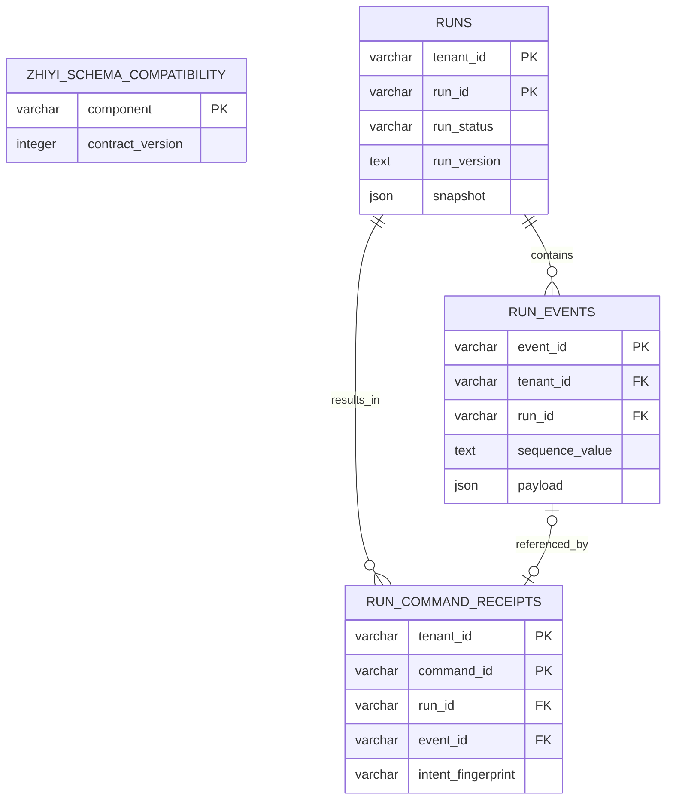
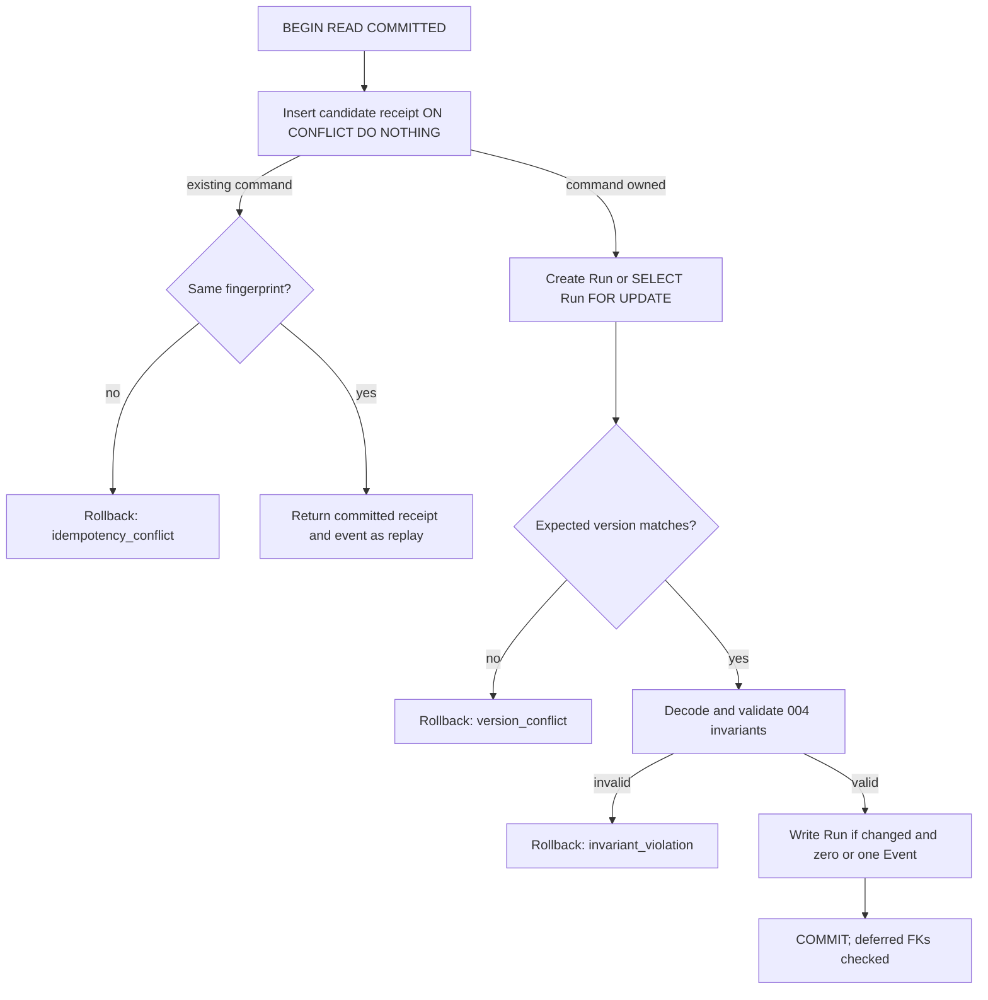

# Data Model: PostgreSQL RunRepository

**Feature**: `005-postgresql-run-repository`

**Contract version**: `1`

**Reference database**: PostgreSQL 18.6

## Modeling Rules

1. PostgreSQL stores product facts; LangGraph Checkpoint data is not part of these
   tables and will use a separate schema in a later feature.
2. Tenant-owned primary/foreign keys and high-frequency indexes carry `tenant_id`.
   `event_id` is the sole globally unique product identifier in this feature.
3. Run snapshots and event payloads have explicit record-format versions. They use
   inspectable JSON text, never pickle, framework objects, provider objects, or
   executable serialization.
4. All domain `Decimal` values use the existing canonical decimal string. Python
   integers without a 004 bound also use canonical digit strings in authoritative
   storage. No database-native numeric range may narrow the domain contract.
   Canonical integer tokens are produced and parsed in bounded base-10 chunks; the
   adapter does not disable Python's process-wide integer-string conversion limit.
5. Projected columns support keys, locks, common filters, and diagnostics. On every
   read, the codec verifies that projections agree with the authoritative document;
   disagreement is `data_corruption`.
6. All timestamps are UTC. Authoritative documents use RFC 3339 with explicit
   `+00:00`; relational projections use `timestamptz`.

## Entity Relationship



The receipt-to-Run and receipt-to-Event foreign keys are deferrable so a creation
transaction can acquire the command key before inserting the new Run/Event. The
receipt primary key remains immediate because it is the `ON CONFLICT` arbiter.

## Table: `zhiyi_schema_compatibility`

Application-owned compatibility metadata, distinct from Alembic's migration graph.

| Column | Type | Null | Rule |
|---|---|:---:|---|
| `component` | `varchar(64)` | no | Primary key; initial row is `run_repository` |
| `contract_version` | `integer` | no | Positive; initial value `1` |
| `installed_at` | `timestamptz` | no | Migration execution time |

The repository accepts an explicit set of contract versions. A missing table/row,
unsupported value, or incompatible column contract produces `schema_incompatible`.
An unreachable database remains `storage_unavailable`.

## Table: `runs`

One authoritative current aggregate snapshot per tenant and Run.

| Column | Type | Null | Rule |
|---|---|:---:|---|
| `tenant_id` | `varchar(128)` | no | Composite primary key; validated identifier |
| `run_id` | `varchar(128)` | no | Composite primary key; validated identifier |
| `task_id` | `varchar(128)` | no | Projected task identifier |
| `agent_id` | `varchar(128)` | no | Projected immutable AgentVersion identity |
| `agent_version_id` | `varchar(128)` | no | Projected immutable AgentVersion identity |
| `agent_build_digest` | `varchar(71)` | no | `sha256:` plus 64 lowercase hex characters |
| `run_status` | `varchar(32)` | no | One of the eight 004 Run statuses |
| `run_version` | `text` | no | Canonical positive integer string |
| `next_event_sequence` | `text` | no | Canonical positive integer string |
| `created_at` | `timestamptz` | no | UTC projection |
| `updated_at` | `timestamptz` | no | `>= created_at` |
| `last_observed_at` | `timestamptz` | no | `>= updated_at` |
| `snapshot_format_version` | `smallint` | no | Initial value `1` |
| `snapshot` | `json` | no | Complete versioned Run document |

### Keys and indexes

- Primary key: `(tenant_id, run_id)`.
- Common status index: `(tenant_id, run_status, updated_at, run_id)`.
- Check constraints validate the status allowlist, canonical positive integer syntax,
  snapshot format version, timestamp ordering, and digest shape.
- There are no lease, worker, heartbeat, attempt, or checkpoint columns.

### Snapshot format version 1

The document contains every field required to reconstruct `Run`:

```text
tenant_id, run_id, task_id,
agent_version { tenant_id, agent_id, version_id, build_digest },
status, version,
budget { deadline_at, all counter limits, max_cost, currency },
usage { all counters, cost, applied_charges },
created_at, updated_at, last_observed_at, next_event_sequence,
result | null
```

All counters, versions, sequence values, and Decimal values are canonical strings in
this persistence document. `applied_charges` is deterministically ordered by
`charge_id`; reference and warning collections preserve their domain tuple order.
`result` preserves its format version, terminal status, safe error fields, approved
answer, controlled references, and usage snapshot. Unknown document fields or
unsupported format versions fail closed as `data_corruption` until an explicitly
compatible codec exists.

The string representation is internal to the persistence record. Decoding restores
domain counters to Python integers, costs to Decimal, and event payload counters to
JSON integers. Round-trip equality therefore means domain numeric equality and the
same public JSON value types; it does not require preserving an equivalent Decimal's
input exponent or trailing-zero spelling.

Authoritative PostgreSQL `json` values are bound from canonical JSON text and selected
back as text. The version-1 codec emits signed JSON integer tokens and reconstructs
them with bounded decimal chunks, including values beyond Python 3.12's default
integer-string conversion limit, without changing that process-wide limit.

## Table: `run_events`

Immutable ordered Run facts.

| Column | Type | Null | Rule |
|---|---|:---:|---|
| `event_id` | `varchar(128)` | no | Global primary key across tenants |
| `tenant_id` | `varchar(128)` | no | Part of Run foreign key and every access path |
| `run_id` | `varchar(128)` | no | Part of Run foreign key |
| `sequence_value` | `text` | no | Canonical positive integer string |
| `sequence_digits` | `integer` | no | Stored generated `char_length(sequence_value)` |
| `event_type` | `varchar(48)` | no | One of the approved 004 event types |
| `occurred_at` | `timestamptz` | no | UTC event time |
| `payload_version` | `smallint` | no | Initial public payload version `1` |
| `record_format_version` | `smallint` | no | Initial persistence record version `1` |
| `payload` | `json` | no | Complete safe event payload |

### Keys, relationships, and indexes

- Primary key: `(event_id)` enforces global uniqueness.
- Unique constraint: `(tenant_id, run_id, sequence_value)`.
- Redundant unique relationship key: `(event_id, tenant_id, run_id)` allows the
  receipt's composite event foreign key to prove ownership.
- Foreign key: `(tenant_id, run_id) -> runs(tenant_id, run_id)` with `ON DELETE
  RESTRICT`.
- Cursor index: `(tenant_id, run_id, sequence_digits, sequence_value)`.
- Event reads compare canonical non-negative integer strings by digit count and then
  lexicographically, which is equivalent to numeric ordering without a `bigint`
  bound.

The adapter always supplies tenant and Run predicates, even when it already has the
globally unique `event_id`. No query may use `event_id` alone to authorize or return
an event.

## Table: `run_command_receipts`

Immutable command outcome and the cross-process idempotency arbiter.

| Column | Type | Null | Rule |
|---|---|:---:|---|
| `tenant_id` | `varchar(128)` | no | Composite primary key and tenant scope |
| `command_id` | `varchar(128)` | no | Composite primary key |
| `run_id` | `varchar(128)` | no | Receipt target Run |
| `command_type` | `varchar(48)` | no | Existing 004 command allowlist |
| `intent_fingerprint` | `varchar(71)` | no | `sha256:` plus 64 lowercase hex characters |
| `resulting_status` | `varchar(32)` | no | Approved Run status |
| `resulting_version` | `text` | no | Canonical positive integer string |
| `event_id` | `varchar(128)` | yes | Zero or one event; `NULL` for zero-event receipt |
| `created_at` | `timestamptz` | no | UTC receipt time |
| `record_format_version` | `smallint` | no | Initial value `1` |

### Keys and relationships

- Immediate primary key: `(tenant_id, command_id)`.
- Deferrable initially deferred Run foreign key:
  `(tenant_id, run_id) -> runs(tenant_id, run_id)`.
- Deferrable initially deferred event foreign key:
  `(event_id, tenant_id, run_id) ->
  run_events(event_id, tenant_id, run_id)`; a null `event_id` represents the valid
  zero-event case.
- Check constraints cover command type, fingerprint, status, positive version, and
  record format.

The table intentionally does not store arbitrary command input or full intent.
Different-intent reuse can therefore return a safe conflict after comparing only the
fingerprint, without reading the Run or exposing the original command.

## Atomic Commit Invariants

The shared application validator and database constraints jointly enforce:

1. Receipt tenant/Run, resulting status/version, and event reference match the
   supplied updated aggregate.
2. Creation requires expected version 0, new Run version 1, and exactly one first
   event.
3. A state-changing commit appends exactly one event, advances version by one, and
   uses the next continuous sequence.
4. A zero-event commit leaves the locked current Run snapshot byte-for-domain equal
   and writes no Run/Event row version.
5. A receipt references at most one event; no failure leaves a receipt without its
   corresponding Run/Event.
6. Event identity is global; sequence uniqueness is tenant-and-Run scoped.
7. Terminal results remain immutable and agree with status, AgentVersion, and usage.
8. Same command and same fingerprint replays before version validation. Same command
   with a different fingerprint fails before any Run read or mutation.

## Transaction State Flow



Every transaction uses `SET LOCAL synchronous_commit = on`, finite statement and lock
timeouts, and no model/tool/network call while holding locks. Lock order is always
command key -> Run row -> Event uniqueness.

## Read Behavior

- `load(tenant_id, run_id)`: primary-key lookup; missing and cross-tenant both return
  `None`.
- `list_events(...)`: returns events after the canonical cursor in strict sequence order,
  with limit 1-1,000. If the page is empty, it then proves the tenant-scoped Run exists;
  missing and cross-tenant Run produce the same existing `not_found` result. This keeps
  the public behavior while avoiding a redundant existence query for populated pages.
- `find_command(...)`: looks up only `(tenant_id, command_id)`. Different fingerprint
  returns the existing safe idempotency conflict; matching fingerprint loads the
  optional event using tenant + Run + event predicates and returns a replay.
- Malformed/unknown record fields, unsupported record format, unknown enum, illegal
  field combination, malformed JSON shape, projection mismatch, or a missing/mismatched
  referenced Run/Event returns `data_corruption`; no damaged value is coerced into a
  valid domain object.

## Migration and Compatibility Lifecycle

Initial upgrade order:

1. Create `zhiyi_schema_compatibility` and insert contract version 1.
2. Create `runs`.
3. Create `run_events`.
4. Create `run_command_receipts` and its deferred foreign keys.
5. Create named checks, unique constraints, and indexes.

Initial disposable downgrade reverses that order. It deletes all Feature 005 data and
must not be used against a data-bearing production database. Data-preserving rollback
restores a verified backup to a fresh database and switches consumers only after
validation. Future revisions use expand/contract and do not raise the compatibility
version until old application versions have drained.

An expand revision adds only nullable or default-safe structure and may backfill in
bounded, idempotent batches outside long write-locking transactions. During mixed
application versions, new writers continue to emit the old persistence record format
unless every old reader already accepts the new format. A strict new format, field
removal/rename, tighter constraint, or compatibility-version advancement is a
contract step performed only after old replicas drain. This keeps strict unknown-field
decoding consistent with rolling upgrades.
