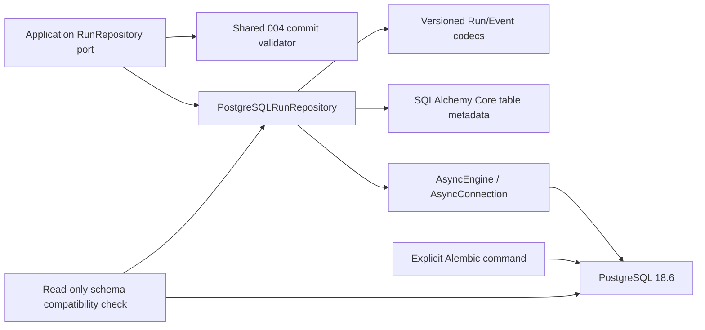

# Implementation Plan: PostgreSQL RunRepository

**Branch**: `codex/005-postgresql-run-repository` | **Date**: 2026-08-25 | **Spec**: [spec.md](./spec.md)

**Input**: Feature specification from
`/specs/005-postgresql-run-repository/spec.md`

## Summary

Implement a production PostgreSQL adapter for the existing 004 `RunRepository`
without changing Run lifecycle semantics. SQLAlchemy 2 Core and Psycopg 3 provide
async data access; Alembic provides an explicit, independently executed schema
migration. One `READ COMMITTED` transaction atomically arbitrates the command key,
locks/CASes the tenant-scoped Run, validates shared 004 invariants, and writes the Run,
zero/one Event, and CommandReceipt.

The design uses a global event primary key, tenant-scoped Run/command keys, deferred
receipt foreign keys, versioned inspectable JSON records, canonical string encoding
for arbitrary valid Decimal/counter values, and a separate application schema
compatibility version. It adds real PostgreSQL contract, restart, concurrency, fault,
migration, restore, redaction, and latency acceptance. Worker, leases, Reconciler,
Checkpoint, API/SSE, Model Gateway integration, and background execution remain
explicitly excluded.

## Technical Context

**Language/Version**: Python 3.12

**Primary Dependencies**: `sqlalchemy[asyncio]==2.0.52`, `alembic==1.19.1`,
`psycopg[binary]==3.3.4`; existing Pydantic/domain libraries remain unchanged

**Storage**: PostgreSQL 18.x; local and CI reference PostgreSQL 18.6 with immutable
container digest; four application-owned tables plus Alembic's version table

**Testing**: pytest + pytest-asyncio, provider-neutral repository contract, real
PostgreSQL integration/fault/migration tests, Ruff, format check, mypy, SDD tests and
design-drift gate

**Target Platform**: Linux server runtime; Linux CI and Docker Compose development on
Linux/macOS

**Project Type**: Python modular-monolith library with hexagonal ports/adapters; no
new service process or public endpoint

**Performance Goals**: With 20 concurrent clients in the declared local environment,
p95 under 100 ms for single Run load, event page, and atomic commit; 100 replay groups
and 100 state-changing version-race groups meet SC-003/SC-004

**Constraints**: Preserve 004 error priority and immutable domain values; no
application precision/scale narrowing; tenant filter on every resource access; global
`event_id`; zero partial records; no automatic migration or unknown-outcome retry; no
SQL/DSN/payload/answer leakage; no network/model calls while locks are held

**Scale/Scope**: One repository adapter, initial Run/Event/Receipt schema, one
compatibility record, one initial migration, shared contract extraction, disposable
PostgreSQL local/CI lane; no production backup service or multi-major compatibility
promise

## Constitution Check

*GATE: Passed before Phase 0 research and re-checked after Phase 1 design.*

| Principle / rule | Pre-research | Post-design evidence |
|---|:---:|---|
| I. Specification before implementation | PASS | Active 005 spec contains scenarios, 25 requirements, 12 measurable criteria, and resolved clarifications; this plan contains no product implementation |
| II. Product semantics own the framework | PASS | Domain/application contracts contain no SQLAlchemy/Psycopg types; Core tables and codecs stay under adapters/infrastructure; shared validator preserves 004 semantics |
| III. Test-first and traceability | PASS | Plan defines shared contract plus unit/integration/fault/migration/performance paths; `$speckit-tasks` must order failing tests before production code and map every file |
| IV. Recoverable, idempotent execution | PASS | Receipt-first replay, optimistic version control, atomic Run/Event/Receipt writes, and original-command resolution of unknown outcomes are explicit; no exactly-once external-effect claim |
| V. Tools/context untrusted | PASS | Feature persists only the existing safe Run/Event/Result contract and introduces no Tool, context, arbitrary SQL, shell, or executable payload behavior |
| VI. Tenant isolation/privacy/least privilege | PASS | Composite tenant Run/command keys, tenant-bearing event relationship/indexes, cross-tenant negatives, secret-safe DSN, and redaction tests are mandatory; global event identity is an explicit approved exception, not an authorization shortcut |
| VII. Observable without hidden reasoning | PASS | Structured safe diagnostics exclude SQL, parameters, payloads, final answers, and hidden reasoning; no Chain-of-Thought field exists |
| VIII. Simple, versioned, reversible change | PASS | Mature pinned dependencies received maintenance/license review; records and schema compatibility are versioned; independent migration, destructive disposable downgrade warning, and data-preserving restore path are defined |
| Database and migration rules | PASS | Short transactions, database constraints, explicit Alembic release step, expand/contract rule, and no application startup migration |
| M0 implementation approval | PENDING NEXT PHASE | The high-risk checklist and task decomposition are complete. Production code still requires a clean cross-artifact analysis and explicit implementation approval |

No constitution or accepted ADR change is required. The planning-time correction to
FR-007/SC-003 only removed an internal contradiction with the already-approved 004
zero-event behavior; it did not add or change product semantics.

## Architecture and Boundaries



### Application/domain boundary

- Keep `Run`, `RunEvent`, `CommandReceipt`, `CommitOutcome`, lifecycle errors, and
  method signatures framework-neutral.
- Add a repository-specific application error family for
  `storage_unavailable`, `commit_outcome_unknown`, `data_corruption`, and
  `schema_incompatible`; do not add these to `RunErrorCode`.
- Extract the current memory-only commit invariant logic into a pure application
  helper used by both Memory and PostgreSQL adapters. Database constraints are
  defense in depth, not a second lifecycle definition.

### Persistence adapter boundary

- `postgresql_schema.py` owns SQLAlchemy Core metadata, named constraints, and index
  definitions.
- `postgresql_codecs.py` owns versioned, deterministic, inspectable conversion. It
  encodes Decimal/counter values as canonical strings and rejects unknown/damaged
  records.
- `postgresql_run_repository.py` owns tenant-safe queries, command arbitration, lock
  order, transaction phase tracking, error mapping, and safe diagnostics.
- No ORM entity or database row is a domain entity. Every successful read returns a
  detached immutable domain value.

### Infrastructure boundary

- `engine.py` resolves the secret-safe URL at assembly, creates the sole SQLAlchemy
  async pool with finite timeouts, pre-ping, hidden parameters, and SQL echo off.
- `schema_compatibility.py` performs a read-only check for accepted contract version
  1. It never invokes Alembic or `metadata.create_all()`.
- Alembic owns structure changes through an independent CLI/job. Application and
  future Worker startup paths only check compatibility.

## Transaction Design

Every commit owns one `READ COMMITTED` transaction and follows this fixed order:

1. Validate public input types and encode the candidate values before acquiring
   database locks.
2. Begin a transaction; set local lock/statement timeouts and
   `synchronous_commit=on`.
3. Insert the complete candidate receipt with an immediate
   `(tenant_id, command_id)` conflict arbiter.
4. If the command already exists, a new statement reads the immutable receipt. A
   different fingerprint fails before Run access; an identical fingerprint loads the
   tenant/Run-scoped event and returns the original replay.
5. If the command is owned, create the expected-version-zero Run or lock the existing
   tenant-scoped Run `FOR UPDATE`; compare the current version.
6. Decode current facts and run the shared 004 validator. For a zero-event command,
   prove the supplied Run equals the current snapshot and do not update the Run.
7. Insert/update the Run when changed, insert zero/one Event, and explicitly commit.
   Deferred receipt foreign keys are checked at commit.

The command key -> Run row -> event index order is used everywhere. There is no
repository-level transaction retry. Failures before commit invocation or confirmed
rollback map to `storage_unavailable`; failures during commit acknowledgement or
SQLSTATE `08007`/`40003` map to `commit_outcome_unknown`.

A zero-event command linearizes when it owns the locked current Run fact. If a
state-changing competitor commits first, the zero-event command observes the newer
version and fails with `version_conflict`. If the zero-event command validates first,
it may commit only its receipt; releasing that lock does not consume the Run version,
so the later state-changing command may still proceed.

Failure precedence is fail-closed: an unreachable store is
`storage_unavailable`; a reachable but unsupported application contract is
`schema_incompatible` before business-row reads; a compatible schema with an invalid
record/projection/reference is `data_corruption`; once commit acknowledgement enters
an unknown phase, `commit_outcome_unknown` overrides any attempt to infer a domain
conflict. Lock/statement timeout, deadlock, serialization abort, connection-acquisition
timeout, or capacity failure maps to `storage_unavailable` only after rollback is
known. The caller, not the repository, owns finite retry/backoff and must preserve the
original command identity for every write retry.

## Persistence Representation

The relational model is defined in [data-model.md](./data-model.md). Key choices:

- `runs`: tenant/Run composite key, query/CAS projections, and complete versioned JSON
  snapshot.
- `run_events`: globally unique `event_id`, tenant/Run ownership, canonical text
  sequence plus digit-length ordering, and versioned JSON payload.
- `run_command_receipts`: immediate tenant/command primary key, zero/one event
  reference, fingerprint and deterministic outcome; deferred ownership foreign keys.
- `zhiyi_schema_compatibility`: application contract version 1, separate from
  `alembic_version`.
- PostgreSQL `json`, not `jsonb`, is authoritative so valid large JSON integers do not
  pass through the PostgreSQL `numeric` range. Decimal values are canonical strings.
- The codec writes authoritative PostgreSQL `json` columns from canonical JSON text
  and reads them back as text before decoding. Arbitrary JSON integers use signed
  base-10 tokens produced and parsed in bounded decimal chunks, so values beyond
  Python 3.12's default integer-string conversion limit round-trip without changing
  the process-wide limit. Naive `str(huge_int)`, `int(huge_digits)`, or default JSON
  integer conversion is not used on an unbounded value.
- String encoding is an internal record representation only. The codec reconstructs
  Decimal and integer domain fields and restores event JSON integers as integers;
  round-trip assertions compare domain numeric values and JSON types, not the input
  Decimal's exponent or trailing-zero spelling.
- Projected fields are checked against decoded authoritative records; mismatch is
  `data_corruption`.

## Migration and Rollback Plan

1. Add Alembic configuration and one manually reviewed initial revision with named
   constraints/indexes.
2. `upgrade head` creates compatibility metadata, Runs, Events, then Receipts.
3. CI runs `alembic check` and `alembic current --check-heads`; normal application
   construction proves it performs no DDL.
4. Future revisions follow expand -> dual-compatible deployment -> drain old replicas
   -> contract. Expand revisions add only nullable/default-safe structure and may use
   idempotent bounded backfills. During coexistence, new writers continue emitting the
   old record format unless every old reader already accepts the new one; a new strict
   record format is emitted only after old replicas drain. Old replicas must be gone
   before rename/drop, constraint tightening, or compatibility-version advancement.
5. `downgrade base` drops all 005 tables in reverse dependency order. It is explicitly
   destructive and only accepted in a disposable environment.
6. Data-preserving rollback uses `pg_dump -Fc`, restore into a fresh database,
   migration/round-trip validation, then controlled cutover. Production backup
   scheduling, PITR service, credentials, and infrastructure provisioning remain out
   of scope.

## Test Strategy

All behavior follows Red-Green-Refactor. `$speckit-tasks` must make the following test
groups fail for the intended missing behavior before production files are added.

### Shared and unit tests

- Extract a provider-neutral RunRepository contract and run it unchanged against
  Memory and PostgreSQL factories.
- Unit-test the shared commit validator, canonical codecs, unsupported format,
  projection mismatch, exception phase/SQLSTATE mapping, and safe `repr`/messages.
- Preserve every current Memory adapter contract result while moving validation.

### Real PostgreSQL integration tests

- Apply migrations to a disposable PostgreSQL 18.6 database; do not use
  `create_all()`.
- Rebuild engines/adapters between write and read to prove restart persistence.
- Cover all eight statuses, four terminal states, event types, zero-event receipts,
  budgets, applied charges, UTC values, optional values, references, and extreme valid
  Decimal/counter values. The boundary set includes at least 12 Decimals, 20,000
  fractional digits, 200,000 integer digits, exponent/trailing-zero equivalents, and
  a 5,000-digit non-negative counter plus positive and negative 5,000-digit nested JSON
  integers. Tests assert that the process-wide integer-string conversion limit is
  unchanged before and after codec and restart round trips.
- Use multiple engines/connections for same-command replay, different-intent conflict,
  same-version state-changing races, zero-event races, duplicate global event IDs,
  continuous pagination, and cross-tenant negatives.
- Inject failures after receipt, Run, and Event statements and prove zero partial
  combinations.

### Failure, migration, recovery, and performance tests

- Known pre-commit connection failure and backend termination before commit must prove
  rollback and return `storage_unavailable`.
- A test transaction-boundary wrapper performs a real PostgreSQL commit, suppresses
  its acknowledgement, and returns `commit_outcome_unknown`; a new adapter replays the
  original command and proves convergence. Repeat each required window 100 times.
- Directly introduce a malformed record and unsupported compatibility version in the
  disposable database; prove `data_corruption` and `schema_incompatible` remain
  distinct and safe.
- Exercise empty upgrade, current-head verification, representative write, custom
  dump, disposable downgrade/re-upgrade, restore to a fresh database, and domain
  comparison.
- Run performance acceptance with PostgreSQL 18.6, pool size 20 and zero overflow,
  at least 100 Runs with 100 events each, 20 clients, 100 warm-up operations and 1,000
  measured operations per operation class. Compute nearest-rank p50/p95 with
  constraints and tenant filters enabled, and record environment/pool/image metadata.

### CI lanes

- Fast/offline: `pytest -m "not online and not postgresql"`, Ruff, format, mypy,
  governance, and design drift.
- PostgreSQL: service health check, explicit migration, `pytest -m postgresql`,
  Alembic head/autogenerate checks, and recovery exercise.
- Every PostgreSQL-dependent contract, integration, migration, fault, and performance
  module declares the registered `postgresql` marker at module scope. CI performs a
  collection-only partition assertion: the PostgreSQL set is non-empty, and the
  database-dependent allowlist—`tests/contract/persistence/test_postgresql_run_repository_contract.py`,
  `tests/integration/persistence/`, and
  `tests/performance/test_postgresql_run_repository.py`—contributes zero nodes to the
  fast lane.
- No Testcontainers or paid Provider call is introduced.

## Security and Observability

- Credentials remain environment/secret inputs. DSN objects have secret-safe `repr`;
  engine output hides parameters and never enables SQL echo.
- Every resource query includes tenant scope. A globally unique event identifier is
  never used alone to authorize or return a fact.
- Named constraints are mapped to stable safe errors; raw SQL, parameters, database
  host/user details, original payloads, final answers, and hidden reasoning do not
  leave the adapter.
- Public repository exceptions and `repr` expose only stable code, constant safe
  message, and optional correlation ID—never tenant/run identifiers. Internal logs may
  include tenant/run identifiers already supplied by the caller, but never the real
  owner or content discovered through a conflict/cross-tenant lookup.
- Structured diagnostics are limited to operation, transaction phase, stable code,
  correlation ID, safe tenant/Run identifiers, duration, and replay flag. Expected
  conflicts avoid stack-trace noise.
- Tests plant known sensitive markers in URL, SQL parameters, event payload, answer,
  and hidden-reasoning-like fields, then scan public errors, printable values, and
  captured logs for zero leakage.
- Application and migration database roles should be separate in production; role
  provisioning and production Secret management are environment responsibilities,
  not Feature 005 code.
- Before the drift report can become `ALIGNED`, an explicit security review must cover
  every tenant-bearing query and index, receipt/event conflict ownership, SQL/DSN/log
  redaction, application-versus-migration privileges, transaction failure mapping,
  and destructive migration guards. All critical/high findings must be resolved and
  re-verified; the review scope, findings, disposition, and evidence are recorded in
  the drift report.

## Project Structure

### Documentation (this feature)

```text
specs/005-postgresql-run-repository/
├── spec.md
├── plan.md
├── research.md
├── data-model.md
├── quickstart.md
├── checklists/
│   ├── requirements.md
│   └── persistence-safety.md
├── contracts/
│   └── postgresql-run-repository.md
├── tasks.md                 # created by $speckit-tasks, not by this plan
└── drift-report.md          # completed during implementation/convergence
```

### Source, migration, test, and delivery paths

```text
src/zhiyi/
├── application/ports/
│   ├── __init__.py
│   ├── run_repository.py
│   └── run_repository_validation.py
├── adapters/persistence/
│   ├── __init__.py
│   ├── memory_run_repository.py
│   ├── postgresql_schema.py
│   ├── postgresql_codecs.py
│   └── postgresql_run_repository.py
└── infrastructure/database/
    ├── __init__.py
    ├── engine.py
    └── schema_compatibility.py

migrations/
├── env.py
├── script.py.mako
└── versions/
    └── 0001_create_run_repository.py

tests/
├── contract/persistence/
│   ├── run_repository_contract.py
│   ├── test_memory_run_repository_contract.py
│   └── test_postgresql_run_repository_contract.py
├── unit/application/ports/
│   ├── test_run_repository_errors.py
│   └── test_run_repository_validation.py
├── unit/adapters/persistence/
│   ├── test_postgresql_codecs.py
│   └── test_postgresql_error_mapping.py
├── unit/infrastructure/database/
│   ├── test_engine.py
│   └── test_schema_compatibility.py
├── integration/persistence/
│   ├── conftest.py
│   ├── test_postgresql_restart.py
│   ├── test_postgresql_concurrency.py
│   ├── test_postgresql_tenant_isolation.py
│   ├── test_postgresql_faults.py
│   └── test_migrations.py
└── performance/
    └── test_postgresql_run_repository.py

alembic.ini
compose.test.yaml
.dockerignore
pyproject.toml
uv.lock
.github/workflows/runtime-python.yml

doc/功能文档.md
doc/技术方案.md
doc/PROJECT.md
doc/SDD开发规范.md
doc/AGENTS.md
README.md
```

**Structure Decision**: Preserve the existing single Python project and hexagonal
layering. Application owns the port/error/validation contract; adapters own SQL and
encoding; infrastructure owns engine assembly and compatibility checks; Alembic owns
migrations; tests separate provider-neutral contract, unit logic, real PostgreSQL
integration/fault/migration behavior, and performance. No new application/service
package is justified.

## Phase 0 and Phase 1 Outputs

- [research.md](./research.md): dependency/license, PostgreSQL version,
  representation, transaction, error, migration, rollback, and test decisions.
- [data-model.md](./data-model.md): tables, keys, indexes, codecs, invariants,
  relationships, and lifecycle.
- [contracts/postgresql-run-repository.md](./contracts/postgresql-run-repository.md):
  application operation, transaction, error, configuration, security, and acceptance
  contract.
- [quickstart.md](./quickstart.md): disposable environment, migration, gates,
  concurrency/fault tests, destructive downgrade warning, restore, and cleanup.

No unresolved planning question remains. Task decomposition and the high-risk
checklist are complete. Implementation still requires a clean cross-artifact analysis
and explicit implementation approval.

## Risks and Mitigations

| Risk | Impact | Mitigation / acceptance evidence |
|---|---|---|
| Receipt-first insert and deferred foreign keys could alter error priority or leave an orphan if ordered incorrectly | High correctness | Immediate command key, deferred ownership FKs, one transaction, shared validator, replay/invalid-candidate and every-statement fault tests |
| Lost commit acknowledgement could be misclassified and retried | Critical consistency | Explicit phase tracking plus SQLSTATE, no repository retry, deterministic real-commit/lost-ack test, original-command convergence |
| PostgreSQL numeric/JSONB ranges could narrow 004 values | High data correctness | Canonical text values, PostgreSQL `json`, extreme Decimal/counter round trips, no rounding/truncation |
| Text sequence ordering/indexing could regress event pagination | Medium performance | Canonical digit-length ordering index and 20-client p95 gate; no switch to bounded `bigint` without a future spec change |
| Snapshot projections could drift from authoritative JSON | High correctness/security | One codec, write both in one statement, validate projection equality on every read, direct-corruption tests |
| Exact-head application checks could block rolling migration | High availability | Separate compatibility contract version, expand/contract procedure, explicit head checks only in release/CI |
| Initial downgrade destroys facts | Critical data loss | Disposal-only warning and target verification; production data-preserving path is backup restore to a new database |
| Psycopg binary packages bundle native libraries and use LGPL | Medium supply chain | Exact lockfile, dependency/license inventory and notices, SBOM/vulnerability scan before image release, and explicit redistribution review before production packaging |
| PostgreSQL 18-only acceptance may not match a later deployment | Medium deployability | Claim only tested 18.x support; add a new compatibility matrix before choosing an older managed service |
| Deterministic lost-ack wrapper does not emulate every network failure | Medium resilience confidence | Use real PostgreSQL commit for the primary gate; optionally add a non-gating proxy smoke test later without weakening deterministic evidence |

## Documentation Impact

The implementation change will update, in the same feature:

- `doc/技术方案.md`: concrete Run/Event/Receipt schema, transaction/error boundary,
  migration compatibility and test environment;
- `doc/功能文档.md`: replace "PostgreSQL persistence not implemented" with the exact
  delivered persistence-only boundary while keeping Worker/API unavailable;
- `doc/PROJECT.md` and `README.md`: project status after verified implementation;
- `doc/SDD开发规范.md` and `doc/AGENTS.md`: PostgreSQL marker ownership,
  fast/real-database CI partition, explicit migration checks, and the no-startup-DDL
  release boundary introduced by the runtime workflow change;
- `specs/005-postgresql-run-repository/drift-report.md`: enumerate all implementation,
  migration, CI, and documentation paths with `Docs-Impact: UPDATED`.

No product documentation is changed during planning merely to claim delivery before
the adapter exists.

## Complexity Tracking

No constitution violation or architectural exception is proposed. The extra schema
compatibility table and canonical text projections are required to satisfy rolling
compatibility and the already-approved unbounded 004 value contract; they do not add
a service, framework layer, or second source of product truth.
