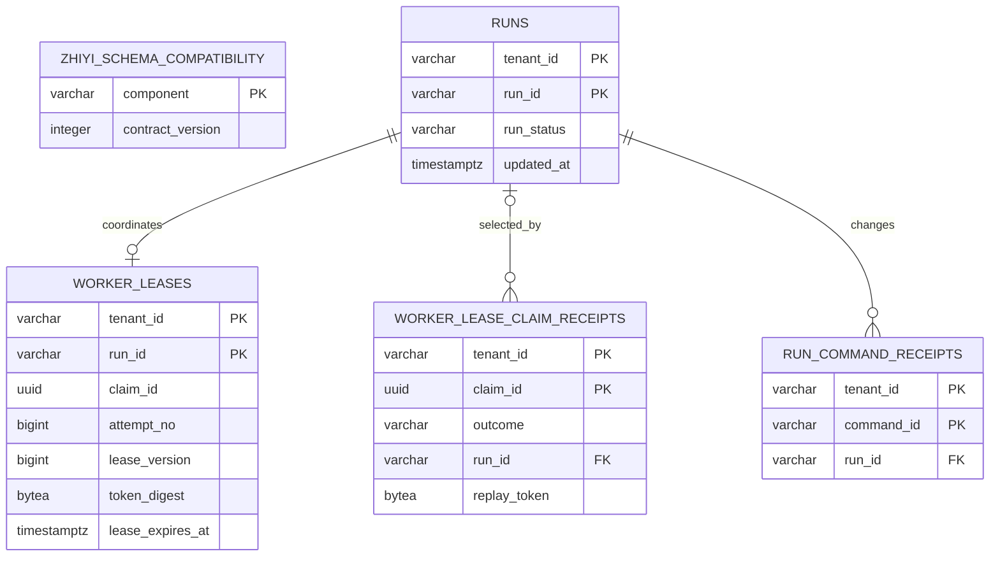
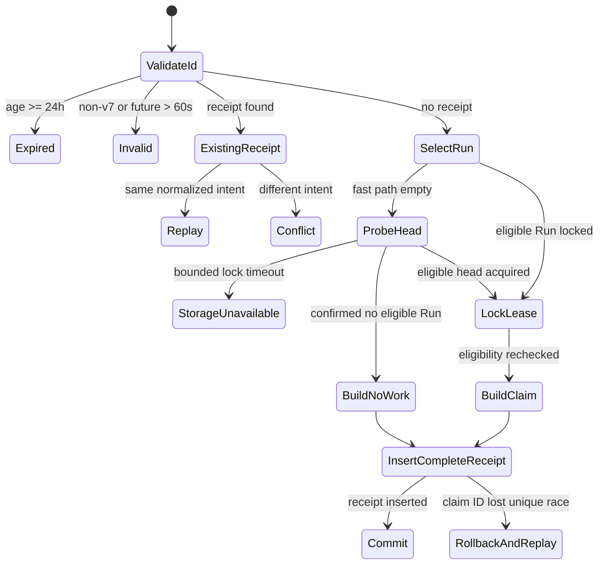

# Data Model: Worker Lease Kernel

**Feature**: `006-worker-lease-kernel`

**Lease contract version**: `1`

**Reference database**: PostgreSQL 18.6, building on Feature 005 migration `0001`

## Modeling Rules

1. `runs`, `run_events`, and `run_command_receipts` remain the authoritative 004
   lifecycle facts. Lease writes alone never change them.
2. Every lease key, foreign key, query, lock, cursor, and high-frequency index carries
   `tenant_id`. Claim IDs are unique only inside a tenant.
3. One retained lease row per tenant/Run holds the most recent ownership attempt.
   New ownership, renewal, and release advance monotonic counters; row deletion is not
   part of normal operation.
4. PostgreSQL time is authoritative. Timestamps are UTC `timestamptz`; authority
   exists only while `released_at IS NULL`, `lease_expires_at > platform_now`, the Run
   remains `queued|running`, and every identity/token check matches.
5. A claim ID is PostgreSQL-issued UUIDv7. Its embedded time, not receipt presence,
   determines the 24-hour replay boundary.
6. Raw fencing-token bytes appear only in the successful claim receipt's restricted
   replay column. Current authority stores a 32-byte SHA-256 digest. No token or
   digest is an index key or observable field. Ordinary 004 receipts remain the only
   durable replay arbiter for lifecycle commands; 006 adds no command-guard table.
7. All tables use named PK/UQ/FK/CK/IX constraints. The application validates domain
   facts; database constraints are defense in depth.
8. Record-format version 1 is inspectable scalar data only. No pickle, framework
   object, Provider object, payload, answer, hidden reasoning, or executable content
   is stored.
9. `LeaseOperationObservation` is a transient application-port value emitted only
   after repository cleanup. It is not a table, receipt, Event, lease fact, or replay
   source and introduces no migration or retention behavior.

## Entity Relationship



## Compatibility Component

Migration 0002 adds one row to the existing `zhiyi_schema_compatibility` table:

| Column | Value |
|---|---|
| `component` | `worker_lease_kernel` |
| `contract_version` | `1` |
| `installed_at` | migration execution time |

The existing `run_repository=1` row does not change. The compatibility cache is keyed
by engine and component; proving RunRepository compatibility cannot satisfy the lease
check accidentally.

## Table: `worker_leases`

One retained current/latest lease fact per tenant and Run.

| Column | Type | Null | Rule |
|---|---|:---:|---|
| `tenant_id` | `varchar(128)` | no | Composite primary key and Run ownership scope |
| `run_id` | `varchar(128)` | no | Composite primary key; FK with tenant to `runs` |
| `worker_id` | `varchar(128)` | no | Current/latest bounded Worker identity |
| `claim_id` | `uuid` | no | UUIDv7 that established this ownership |
| `token_digest` | `bytea` | no | Exactly 32 bytes; never projected to public results |
| `attempt_no` | `bigint` | no | Positive; first ownership 1, each new ownership +1 |
| `lease_version` | `bigint` | no | Positive; every claim/renew/release mutation +1, never resets |
| `duration_seconds` | `smallint` | no | Inclusive 10–30 |
| `acquired_at` | `timestamptz` | no | Captured PostgreSQL time for current/latest ownership |
| `heartbeat_at` | `timestamptz` | no | `>= acquired_at`; equals acquisition until renewal |
| `lease_expires_at` | `timestamptz` | no | `> heartbeat_at`; authority expires at equality |
| `released_at` | `timestamptz` | yes | When set, token is immediately non-authoritative |
| `record_format_version` | `smallint` | no | Initial and only accepted value `1` |

### Keys, constraints, and indexes

- Primary key: `(tenant_id, run_id)`.
- Unique current/latest claim: `(tenant_id, claim_id)`.
- Foreign key `(tenant_id, run_id) -> runs(tenant_id, run_id) ON DELETE RESTRICT`.
- Checks: non-empty bounded identifiers; UUID version 7/RFC variant; 32-byte digest;
  positive `attempt_no`/`lease_version`; duration 10–30; heartbeat/expiry order and
  `released_at >= acquired_at` when present (terminal/wait cleanup may occur after
  natural expiry);
  `record_format_version=1`.
- Inactive-running observation expression index:
  `(tenant_id, COALESCE(released_at, lease_expires_at), run_id)`.
- Token digest is not indexed. The repository locks by tenant/Run primary key and
  compares the digest in application code with a constant-time primitive.

### Mutation rules

| Operation | `attempt_no` | `lease_version` | token | timestamps |
|---|---:|---:|---|---|
| First claim | `1` | `1` | new | acquire/heartbeat/expiry from captured DB time |
| Claim after release/expiry | `+1` | `+1` | new | replace ownership times, clear release |
| Successful renew | unchanged | `+1` | unchanged | heartbeat and expiry from one captured DB time |
| Successful release | unchanged | `+1` | unchanged but revoked | set `released_at` |
| Failed/replayed conditional operation | unchanged | unchanged | unchanged | unchanged |

The row is not deleted on release or natural expiry. This retains the monotonic facts
needed to reject stale operations and compute the next attempt.

## Table: `worker_lease_claim_receipts`

One immutable determined result for each tenant-scoped claim command during its
replay window.

| Column | Type | Null | Rule |
|---|---|:---:|---|
| `tenant_id` | `varchar(128)` | no | Composite primary key |
| `claim_id` | `uuid` | no | Composite primary key; UUIDv7 |
| `claim_issued_at` | `timestamptz` | no | Equals `uuid_extract_timestamp(claim_id)` |
| `replay_expires_at` | `timestamptz` | no | Exactly `claim_issued_at + interval '24 hours'` |
| `worker_id` | `varchar(128)` | no | Explicit normalized claim intent |
| `duration_seconds` | `smallint` | no | Explicit/default-normalized value 10–30 |
| `intent_format_version` | `smallint` | no | Initial/accepted value `1`; part of canonical intent |
| `intent_fingerprint` | `varchar(71)` | no | `sha256:` plus 64 lowercase hex characters |
| `outcome` | `varchar(16)` | no | `claimed` or `no_work`; no committed pending state |
| `run_id` | `varchar(128)` | yes | Required only for `claimed` |
| `attempt_no` | `bigint` | yes | Initial immutable claim result |
| `initial_lease_version` | `bigint` | yes | Initial immutable claim result |
| `lease_acquired_at` | `timestamptz` | yes | Initial immutable claim result |
| `lease_expires_at` | `timestamptz` | yes | Initial immutable claim result |
| `replay_token` | `bytea` | yes | Exactly 32 raw bytes for `claimed`; restricted projection |
| `created_at` | `timestamptz` | no | Database insertion time; not the replay boundary |
| `record_format_version` | `smallint` | no | Initial and only accepted value `1` |

### Keys, constraints, and indexes

- Primary key: `(tenant_id, claim_id)`, immediate for conflict arbitration.
- Optional foreign key `(tenant_id, run_id) -> runs(tenant_id, run_id)`.
- UUID version, issuance/expires derivation, fingerprint, intent version, duration,
  positive counters, and record version checks.
- One complete outcome-nullability check:
  - `no_work`: all Run/lease/token result columns are null;
  - `claimed`: all Run/lease/token result columns are non-null and time-ordered.
- Cleanup index: `(replay_expires_at, tenant_id, claim_id)`.

There is no `pending` outcome. Same-ID racers may tentatively lock different Runs, but
only the transaction that inserts the complete receipt can commit; every loser rolls
back its lease mutation and then reads the winner from a fresh transaction.

### Retention and replay

- Before receipt lookup, derive `issued_at` from the UUID and compare to captured
  PostgreSQL time.
- At `issued_at + 24h`, return `idempotency_expired` even if the row remains.
- A later separately specified cleanup capability may delete rows in bounded batches
  where `replay_expires_at <= platform_now`; delayed cleanup cannot extend behavior.
- 006 creates the index but no cleanup process and enforces no maximum physical
  retention. Expired raw replay tokens can therefore remain in the database and its
  backups. This is an explicit M0 preproduction/disposable-data risk acceptance and a
  production-enable hard block until retention SLO or encryption/key rotation exists.
- Same ID/same `intent_format_version=1`, normalized Worker, and normalized duration
  returns the immutable initial result. Tenant scopes the key rather than being
  duplicated inside the fingerprint. Any future result-affecting intent field requires
  a new intent version before reuse is allowed.
  `currently_authoritative` is computed from the current Run/Lease fact at replay time
  and is not stored in the receipt.
- Same ID/different intent is `idempotency_conflict` and reveals no original Run/token.

## Claim Transaction State Machine



`RollbackAndReplay` starts a new transaction and applies the ordinary receipt replay
rules. No lease fact from the losing transaction survives.

## Authority State

A token is currently authoritative only when all conditions are true at one captured
database time:

```text
tenant_id, run_id, worker_id, claim_id, attempt_no match
SHA-256(presented token) matches current token_digest
released_at is null
lease_expires_at > platform_now
Run.status is queued or running
```

At equality with `lease_expires_at`, authority is false. A separate read can report
this state but cannot authorize a later write; `commit_with_lease()` repeats the
complete check under locks in its own transaction.

## Inactive Running Observation

For a `running` Run, `authority_ended_at` is
`COALESCE(released_at, lease_expires_at)`. The safe projection contains only tenant ID,
Run ID, attempt number, lease version, acquired/heartbeat timestamps,
`authority_ended_at`, and reason `expired|released`. Worker ID and claim ID are not
needed to coordinate recovery and are deliberately excluded together with raw token,
token digest, claim fingerprint, Run input/output, result, events, and 004 receipt
data.

The first page captures a PostgreSQL `as_of`. Pages are ordered by
`(authority_ended_at, run_id)` and use a tenant-bound cursor containing the same
`as_of` and last key. Page size is 1–1,000. The query joins `runs` and
`worker_leases` on both tenant and Run, requires `running` and
`authority_ended_at <= as_of`, and never locks or writes rows. New expirations/releases
after `as_of` are excluded. A candidate that changes status before a later page may be
omitted; no duplicate, reverse order, cross-tenant row, OFFSET fallback, or stale
non-running result is allowed. Zero-gap acceptance uses an unchanged candidate set.

## Corruption Conditions

The adapter returns `data_corruption` rather than guessing when it reads any of:

- an invalid UUID version, digest/token length, duration, record version, timestamp
  order, outcome/nullability combination, or non-positive counter;
- a claim receipt whose derived UUID issuance/deadline differs from its projections;
- a lease whose tenant/Run reference is absent or mismatched;
- a non-monotonic replacement observed by deterministic fault/concurrency probes;
- multiple facts that purport to be current for the same tenant/Run (including a
  physical-constraint bypass introduced by a corruption test).

Public errors remain constant and do not expose which cross-tenant or sensitive fact
was malformed.

## Migration and Rollback

Revision `0002_create_worker_lease_kernel.py` is expand-only from 0001:

1. Create `worker_leases`.
2. Create `worker_lease_claim_receipts`.
3. Create the declared indexes.
4. Insert `worker_lease_kernel=1` compatibility metadata.

Downgrade to 0001 reverses this order and removes only the 006 compatibility row.
It destroys all active lease/claim facts, so it is accepted only on a verified
disposable database. Production application rollback leaves the additive schema in
place. Data-preserving structural rollback restores a pre-006 logical backup to a new
database, verifies 0001 and the RunRepository contract, then uses a controlled cutover.
Before any restored database can receive coordination traffic, operators must verify
its database clock is at/after every restored `lease_expires_at` and all old Worker
connections are drained; restored rows are historical facts, never proof that an old
Worker may resume authority.
