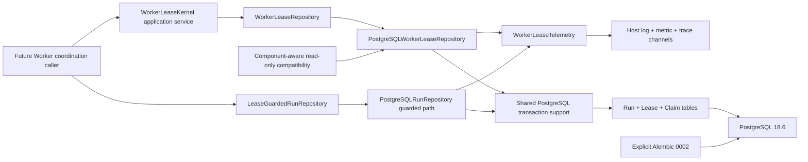

# Implementation Plan: Worker Lease Kernel

**Branch**: `codex/006-worker-lease-kernel` | **Date**: 2026-08-26 | **Spec**: [spec.md](./spec.md)

**Input**: Feature specification from
`/specs/006-worker-lease-kernel/spec.md`

## Summary

Implement a PostgreSQL-backed Worker Lease Kernel that can issue time-bearing claim
IDs, atomically claim one tenant-scoped queued Run, renew/read/release short leases,
fence stale owners, expose read-only inactive-`running` candidates, and atomically guard
future Worker-owned 004 lifecycle commits, and emit one safe terminal operation fact
to required framework-neutral log/metric/trace channels after every public repository
call. It does not implement a Worker loop,
LangGraph, Checkpoint, Agent/model/Tool/Graph execution, Reconciler, or recovery.

The design adds separate application ports and two additive PostgreSQL fact sets:
one retained current lease per tenant/Run and immutable claim receipts for exact
24-hour behavioral replay. Claims
use PostgreSQL-issued UUIDv7 IDs, 256-bit random tokens, `READ COMMITTED`, stable FIFO
ordering, `FOR UPDATE SKIP LOCKED`, a bounded blocking head probe before any no-work
decision, and `Run -> Lease` row locks. Renew/release use
current token plus monotonic `lease_version`; guarded Run commits validate fencing and
Run version inside the existing 005 atomic transaction. Migration 0002 is expand-only
and adds an independent `worker_lease_kernel=1` compatibility component. Telemetry is
an injected application port with three isolated channels; 006 adds no exporter SDK.

## Technical Context

**Language/Version**: Python 3.12

**Primary Dependencies**: Existing `sqlalchemy[asyncio]==2.0.52`,
`alembic==1.19.1`, and `psycopg[binary]==3.3.4`; standard-library `uuid`, `secrets`,
`hashlib`, `hmac`, and base64 utilities; no new third-party dependency

**Storage**: PostgreSQL 18.6, using the existing Run/Event/004 receipt schema plus
two new 006 tables and one new component compatibility row

**Testing**: pytest + pytest-asyncio, framework-neutral unit/contract tests, real
PostgreSQL 18.6 contract/concurrency/restart/fault/migration/redaction tests, Ruff,
format check, mypy, SDD tests, design-drift, analyze, and converge

**Target Platform**: Linux server runtime and Linux CI; disposable Docker Compose
acceptance on Linux/macOS development hosts

**Project Type**: Python modular-monolith library with hexagonal domain/application/
adapter/infrastructure boundaries; no new service process or endpoint

**Performance Goals**: With at least 10,000 queued Runs, pool size 20/zero overflow,
20 clients, 100 warmups and 1,000 measured samples per operation, nearest-rank p95
below 200 ms for full claim-ID issuance + claim, renew, authority read, and release

**Constraints**: Lease duration 10–30 seconds/default 30; database authority time;
one Run per claim; no raw token/DSN/SQL/payload leakage; tenant predicate on every
fact; no internal write retry; no DDL at application startup; no lifecycle mutation by
lease-only operations; no external call while locks are held; terminal telemetry only
after transaction/connection release and unable to alter business results; exact claim replay for
24 hours; UUID more than 60 seconds in the future is invalid; 006 lock timeout
1–5,000 ms and statement timeout 1–10,000 ms/no smaller than lock timeout

**Scale/Scope**: One PostgreSQL coordination adapter, one stronger guarded Run port,
one expand migration, 100 x 20 contention groups, 100 ownership/failure cycles, 1,000
inactive-running observations, recording telemetry acceptance, and local/CI acceptance;
no production telemetry exporter, scheduler,
cleanup daemon, deployment, backup service, or execution-capacity claim

## Constitution Check

*GATE: Passed before Phase 0 research and re-checked after Phase 1 design.*

| Principle / rule | Pre-research | Post-design evidence |
|---|:---:|---|
| I. Specification before implementation | PASS | Active 006 spec has four prioritized scenarios, 30 requirements, 14 measurable criteria, seven resolved clarifications, and no unresolved placeholder; this plan contains design only |
| II. Product semantics own the framework | PASS | Worker/lease values and ports contain no SQLAlchemy/Psycopg/LangGraph types; PostgreSQL UUID/time, tables, codecs, and transactions remain adapters; existing 004 port is unchanged |
| III. Test-first and traceability | PASS | Concrete unit/contract/integration/fault/migration/performance paths are listed; `$speckit-tasks` must put each failing behavior test before its implementation and name every edited file |
| IV. Recoverable, idempotent execution | PASS | Exact claim receipt replay, complete-proof/monotonic fencing, unchanged 004 replay priority, and operation-specific unknown-commit convergence are explicit; no external-effect exactly-once claim is made |
| V. Tools/context untrusted | PASS | Kernel stores coordination metadata only and creates no Tool/context/SQL execution surface; no Agent/model/Tool/Graph behavior occurs under a lease |
| VI. Tenant isolation/privacy/least privilege | PASS | Tenant-bearing keys/locks/cursors/indexes, cross-tenant negatives, restricted replay-token projection, digest-only authority facts, and sentinel redaction are mandatory |
| VII. Observable without hidden reasoning | PASS | A required framework-neutral telemetry port receives exactly one safe terminal fact per public operation in each log/metric/trace channel after lock release; positive emission, channel isolation, stable fields, and forbidden token/SQL/payload/answer/reasoning fields are tested without introducing Langfuse/OpenTelemetry |
| VIII. Simple, versioned, reversible change | PASS | Existing mature pinned stack is reused; the conflicting command-guard table was removed; component and record contracts are versioned; migration 0002 is additive; disposable destructive downgrade and data-preserving restore/cutover are documented |
| Database/transaction rules | PASS | Explicit `READ COMMITTED`, short transactions, fixed receipt/Run/Lease lock order, finite timeouts, database constraints, SQLSTATE/phase classification, and no application auto-migration/retry |
| M0 product implementation approval | PENDING NEXT PHASE | Planning artifacts do not authorize product code. After checklist/tasks/analyze are clean, implementation still requires explicit user approval recorded in the feature workflow |

The planning-time state-name correction from `waiting_input` to the established
`waiting_resolution` removed a conflict with 004 and migration 0001. Research also
clarified FR-004: bounded platform transactions must not starve an eligible queue head.
The `SKIP LOCKED` fast path now performs one bounded blocking head probe before
persisting no-work, so an externally locked final eligible head becomes an observable
storage failure rather than a false empty result. Post-analysis remediation also added
the constitution-required positive telemetry port without adding an exporter or service.
Neither correction adds a new lifecycle state or expands into Worker execution.

No constitution or ADR amendment is required.

## Architecture and Boundaries



### Domain/application boundary

- Add immutable Worker/claim/token/lease/authority/mutation/cursor values under
  `domain/worker_leases`; token string/representation is always redacted.
- `ClaimLeaseCommand`, `RenewLeaseCommand`, and `ReleaseLeaseCommand` normalize and
  validate complete intent before persistence. The application service computes the
  canonical claim fingerprint and does not accept Worker time.
- `WorkerLeaseRepository` owns coordination operations. `LeaseGuardedRunRepository`
  extends the usable capability for Worker-owned lifecycle writes without changing
  `RunRepository.commit()` or the Memory adapter.
- A Worker-owned write is selected by authority source, not command name: new facts
  produced by Worker execution require the stronger port; independently authorized
  control-plane create/cancel/deadline commands retain ordinary 004 authority.
- Authority/conditional outcomes expose `may_start_new_work`; it is true only for a
  currently authoritative result and false for unknown/storage/noncurrent/expired
  outcomes. 006 provides the signal but no Worker loop or interruption mechanism.
- `LeaseTokenGenerator` is injectable for deterministic unit tests; the production
  implementation uses `secrets.token_bytes(32)` outside database locks.
- `WorkerLeaseTelemetry` is a required framework-neutral port. It receives one
  immutable terminal `LeaseOperationObservation` per public repository invocation in
  each log, metric, and trace channel. The record uses stable safe IDs and bounded
  values only; 006 implements no OpenTelemetry/Langfuse exporter.
- Reuse the existing `RunRepositoryError` storage family. Add safe lease semantic
  errors/outcomes for `invalid_input`, `idempotency_conflict`,
  `idempotency_expired`, `lease_not_current`, and `lease_expired`.

### Persistence adapter boundary

- `postgresql_worker_lease_schema.py` extends the existing shared SQLAlchemy Core
  metadata with reviewed tables, named constraints, and indexes.
- `postgresql_worker_lease_codecs.py` converts scalar rows to immutable values,
  verifies projections/record versions, and never places a raw token in printable
  output.
- `postgresql_worker_lease_repository.py` owns UUID issuance, claim selection,
  renew/release, authority reads, keyset observation, transaction phases, safe
  mappings, and post-transaction telemetry fanout.
- `postgresql_transaction_support.py` extracts only 005/006 shared mechanics:
  transaction phase tracking, local settings, SQLSTATE classification, receipt-first
  004 arbitration, and the same-connection lifecycle commit helper. It does not move
  domain invariant decisions into infrastructure.
- `postgresql_run_repository.py` keeps ordinary `commit()` behavior and adds the
  stronger method using the shared helper plus a lease-guard callback under the same
  connection/transaction. Only `commit_with_lease()` emits 006 telemetry; ordinary 005
  `commit()` retains its released behavior.

### Infrastructure boundary

- `infrastructure/security/lease_tokens.py` generates random token bytes; it has no
  persistence or logging responsibility.
- `schema_compatibility.py` becomes generic by component and accepted-version set,
  with per-engine/per-component locking and caching. Existing
  `ensure_schema_compatible(engine)` remains a RunRepository wrapper so 005 callers do
  not change.
- The existing engine configuration remains the sole pool and keeps
  `hide_parameters=True`, pre-ping, and SQL echo off. 006 transaction options are
  construction-validated: lock timeout 1–5,000 ms, statement timeout 1–10,000 ms and
  no smaller than lock timeout; both default to the existing 5,000 ms.
- Alembic alone changes structure. No constructor/startup calls Alembic,
  `create_all()`, cleanup, or repair.
- Telemetry channel calls occur only after the repository transaction and connection
  scope are closed. Each channel is attempted independently; any channel exception is
  contained and cannot replace a repository result or retry a database operation.

## Core Transaction Design

All writes use explicit short `READ COMMITTED` transactions, set
`synchronous_commit=on`, and apply finite lock/statement timeouts. Each concurrent
task owns one connection. Token generation and input encoding occur before locks; no
log, metric, trace exporter, or other external call occurs while a transaction/lock is
active. The immutable terminal observation is fanned out only after cleanup.

### Claim ID issuance and age

1. Read-only component compatibility check.
2. Execute `SELECT uuidv7()` and return an opaque `uuid.UUID`.
3. In `claim`, Python rejects a non-v7/variant UUID before business access; PostgreSQL
   extracts the UUID timestamp and captures a wall-clock value. Future-over-60s is
   invalid and age at least 24h is expired before receipt or queue access. If database
   time is unavailable, classification is `storage_unavailable`, never a local-clock
   age guess.

Issue response loss permits a new issuance because no write occurred. Once claim
starts, only the retained original ID may resolve that write.

### Claim transaction

1. Validate typed input, UUIDv7 version/variant, intent format version, and generate a
   256-bit token candidate before locks.
2. Capture PostgreSQL time, validate the UUIDv7 future/24-hour boundaries, and stop
   before receipt or queue access when invalid/expired.
3. Check for an existing tenant/claim receipt. Same intent replays; different intent
   conflicts before queue access.
4. Select one tenant `queued` Run ordered `(updated_at, run_id)` with eligibility
   against current lease and `FOR UPDATE OF runs SKIP LOCKED`.
5. If the fast path selects no row, run the same oldest-eligible query once without
   `SKIP LOCKED`, under the configured lock/statement timeouts. A lock timeout is
   `storage_unavailable`; an acquired row is rechecked, while a confirmed empty result
   is the only path that may build no-work.
6. If selected, lock/recheck its lease row, capture fresh PostgreSQL time, and create
   or replace ownership with new token, `attempt_no+1`, `lease_version+1`, and expiry.
7. Insert the complete immutable claim receipt with
   `ON CONFLICT (tenant_id, claim_id) DO NOTHING RETURNING`.
8. If the receipt insert loses a same-ID race, roll back the whole transaction before
   reading/replaying the winner in a new transaction. Otherwise commit.

No committed receipt has a pending state. A race loser never leaves a lease. Claim
does not touch the Run snapshot, events, budget/usage/result, or 004 receipts.

### Fair queue selection

The existing `(tenant_id, run_status, updated_at, run_id)` index matches the current
004 queue invariant: Runs are created as `queued` and never re-enter that state. Every
new claim starts from the head and uses no advancing cursor. `SKIP LOCKED` proves
high-throughput non-duplication, not mathematical fairness and cannot itself surface a
row-lock timeout. Therefore it is only the fast selection path: immediately before a
claim would persist no-work, the transaction executes one blocking oldest-eligible
head query without `SKIP LOCKED`, under the same finite timeouts. If the row remains
externally locked, the wait fails as `storage_unavailable`; if it becomes available,
the transaction locks and rechecks it; only a confirmed empty probe may produce a
no-work receipt. “Continuously eligible” means the Run stays queued, has no effective
lease, and is not cancelled/transitioned during the drain. A temporary platform lock
does not remove it from the acceptance set, while a nonconforming permanent lock is an
observable storage failure. SC-002 is accepted under fixed ordering and bounded
platform transactions; a future always-blocking head algorithm remains unnecessary.

### Renew, release, and confirmation

Both mutations lock tenant-scoped `Run -> Lease`, capture a fresh database time, and
condition on complete proof plus expected `lease_version`.

- Renew additionally requires unreleased/unexpired authority and Run
  `queued|running`; it keeps token/attempt, advances lease version once, and sets
  heartbeat/expiry from the captured time.
- Release advances once and revokes immediately. A matching lease may be cleaned after
  the Run enters waiting/terminal without changing the Run or granting authority.
- Same-version concurrent mutations have at most one advance. Old/repeated requests
  return current safe state only and store no operation receipt.
- After an unknown commit, an unchanged token/attempt/version permits the identical
  condition to be retried only while release/expiry/Run status still allow it; an
  advanced version is confirmation only even if expiry follows; a changed token or
  attempt permanently fences the old operation. A second storage failure stays safe
  and never permits work. Retained rows, never-reset attempt/version, and the complete
  token+claim+attempt proof eliminate ABA even if random token bytes collide.

### Atomic guarded Run commit

The fixed lock order is 004 command receipt arbiter -> Run -> Lease -> Event/index
writes.

1. Existing 004 receipt replay/conflict retains 004 priority.
2. A matching existing 004 receipt replays with no write even after lease expiry,
   exactly like ordinary `RunRepository.commit()`. An old 005 binary may return the
   same replay; this grants no new execution authority.
3. A new command locks Run then Lease, captures database time, validates full current
   proof/status/expiry and expected Run version, then runs the shared 004 validator.
4. Run, zero/one Event, and 004 CommandReceipt commit atomically. The lease is checked
   but not renewed or released. Zero-event 004 semantics do not consume a Run version.

This path creates no new lifecycle behavior and is not invoked by a Worker in 006.

### Inactive `running` observation

The first list page captures a PostgreSQL `as_of`; its tenant-bound immutable cursor
stores `as_of`, last `authority_ended_at`, and last Run ID. Queries join Run/Lease on
tenant+Run, require `running` and
`COALESCE(released_at, lease_expires_at) <= as_of`, then use the same expression plus
Run ID as keyset order with at most `limit+1` rows. Limits are 1–1,000/default 100. The
single-Run query uses the same eligibility. Projection excludes Worker/claim/token/
digest/business payload. The cursor is internal typed data with no 006 serialization,
signing, or expiry; a future external API must add authenticated opaque encoding and
TTL. New inactive rows after fixed `as_of` are excluded; transitions out of `running`
may create later-page gaps but never duplicates/reverse order/leakage. Static SC-013
data must have zero gaps. Neither path locks for update or changes/reclaims work.

### Terminal operation telemetry

Every `issue_claim_id`, claim, authority read, renew, release, inactive single/list
observation, and `commit_with_lease` invocation constructs one immutable terminal
`LeaseOperationObservation` after its transaction/connection scope has closed. The
repository then independently attempts `record_log`, `record_metric`, and
`record_trace` on the required `WorkerLeaseTelemetry` port. One channel failure cannot
prevent the other channels, alter the already determined result, or trigger a database
retry.

The record contains a stable operation name, final transaction phase, stable outcome/
error code, safe caller-supplied correlation and tenant/Run/Worker/claim identifiers
where policy permits, bounded duration/latency buckets, and replay/empty/contention
flags. It never includes raw token/digest/fingerprint, SQL/parameters/DSN, discovered
cross-tenant identity, Run payload/result, answer, or hidden reasoning. 006 proves
positive fanout with recording channels but supplies no network exporter, background
telemetry queue, OpenTelemetry SDK, Langfuse adapter, sampling, or deployment wiring.

## Persistence Representation

The complete relational rules are in [data-model.md](./data-model.md). Key points:

- `worker_leases`: tenant/Run PK, current/latest Worker/claim/token digest, duration,
  attempt/version, acquire/heartbeat/expiry/release time, record version.
- `worker_lease_claim_receipts`: tenant/UUIDv7 PK, issuance/replay deadline, explicit
  normalized versioned intent, complete `claimed|no_work` result, and restricted raw
  replay token.
- Token/digest is never indexed or included in general projections. Current token
  matching loads by tenant/Run under lock and uses constant-time digest comparison.
- Claim behavioral expiry derives from UUID time. No cleanup process or physical
  maximum is implemented; raw tokens may remain in database/backups, so 006 is not
  production-enableable until a later retention-SLO or encryption/key-rotation Spec.
- Records whose projections, constraints, references, or versions cannot reconstruct
  a unique legal fact return `data_corruption`; they are never guessed or repaired.

## Migration, Rolling Upgrade, and Rollback

1. Add reviewed migration `0002_create_worker_lease_kernel.py`; never edit 0001.
2. 0002 creates both new tables/indexes and inserts
   `worker_lease_kernel=1`; it leaves `run_repository=1` and all 005 tables unchanged.
3. Run `alembic upgrade head`, `current --check-heads`, and `alembic check` as an
   independent release/CI step before deploying 006 code.
4. Old 005 replicas ignore additive 006 tables and continue using contract 1. New 006
   code fails closed on a database at only 0001. Ordinary startup executes no DDL.
5. Future changes follow expand -> dual-compatible deploy -> drain old replicas ->
   contract. No rename/drop/constraint tightening or compatibility bump occurs while
   an old reader/writer remains.
6. `downgrade 0001` drops claim and lease tables plus the 006 compatibility row in
   reverse dependency order. It preserves Run/Event/004 receipt data but destroys
   active coordination, so it is disposable-only.
7. A missing compatibility row, missing table/index/constraint, or partial malformed
   0002 fails `schema_incompatible` before business reads; application startup repairs
   nothing.
8. Production application rollback leaves additive 0002 in place. Data-preserving
   structural rollback restores a verified pre-006 custom-format dump into a fresh
   database, validates compatibility/facts, drains old Worker connections, and
   quarantines the restored database until its clock is at/after every restored lease
   expiry before controlled cutover. Restored leases never resume old execution
   authority. Backup service, PITR, production migration, and deployment remain
   outside 006 authorization.

## Failure and Security Design

- Reuse 005 phase + SQLSTATE mapping. Known non-commit is `storage_unavailable`;
  COMMIT acknowledgement uncertainty or SQLSTATE `08007`/`40003` is
  `commit_outcome_unknown`. No adapter write retry occurs.
- Claim resolves unknown commit with original claim ID/intent. Renew/release first
  read the same proof's current token/attempt/version/status. Guarded commit uses the
  original 004 command and lifecycle intent; an absent receipt still requires a
  currently valid same-transaction lease guard.
- Input/cursor errors, idempotency conflicts/expiry, non-current/expired authority,
  corruption, compatibility, and storage errors have constant safe public text.
- Raw token exists only in the authorized return path, incoming proof, and restricted
  successful claim receipt. Current lease facts contain a digest. `str`, `repr`,
  logs, metrics, traces, SQL diagnostics, and exception messages exclude both.
- All cross-tenant missing/conflicting operations are indistinguishable from local
  absence/non-current results and never return discovered owner/claim/version/expiry.
- Database host clock is the sole authority but is wall time, not a monotonic clock.
  Platform/database operations owns any production NTP offset/backward-jump alert;
  this is a production-enable prerequisite, not a metric delivered by 006. Tests prove
  no Worker clock affects authority but cannot eliminate a database-host clock fault.
- Terminal telemetry uses only bounded safe fields and is emitted after connection
  cleanup. Log, metric, and trace calls are isolated from each other and from the
  repository result; recording failures never cause a write retry or partial mutation.

## Test Strategy

All executable work follows Red-Green-Refactor. `$speckit-tasks` must order each group
so the missing behavior fails for the intended reason before production changes.

### Unit and contract tests

- Domain value tests cover identifier bounds, UUIDv7 vectors, token redaction,
  timestamp order, duration defaults/bounds, immutable outcomes, cursor tenant binding,
  and all stable safe errors.
- Application tests cover canonical intent fingerprints, no Worker time, renew-by
  math, service/port delegation, stop-starting-new-work safety signals, immutable
  terminal-observation values, three-channel fanout, and observer-failure isolation.
- Token tests generate at least 100,000 32-byte values, assert size/uniqueness and
  zero printable/log sentinels without claiming statistical testing proves
  cryptographic security.
- Codec/schema/error tests cover every record/check/projection, component compatibility
  cache separation, phase/SQLSTATE classification, and proof that telemetry runs only
  after transaction/connection cleanup.
- A reusable repository contract expresses claim/replay/authority/renew/release/
  observation semantics; only real PostgreSQL satisfies its concurrency/persistence
  acceptance. Unit services may use behavior stubs, not as evidence for FR-026.

### Real PostgreSQL integration tests

- 100 one-Run groups x 20 independent connections; 100 Runs x 20 clients; separate
  no-contention FIFO; no duplicate/omission/lifecycle change; bounded-fairness
  diagnostics; and a single externally locked final queue head that must time out in
  the blocking head probe rather than persist no-work.
- UUIDv7/Psycopg round trips and exact `+60s`, `24h` boundaries; same-ID replay,
  different-intent conflict, no-work immutability, cleanup boundary, and same ID in
  different tenants.
- 100 complete ownership cycles, same-version renew/release races, expiry equality,
  replacement fencing, terminal/wait cleanup, and no ABA.
- Guarded command replay/new-write paths against renewal, release, token expiry,
  replacement, cancellation, terminal transition, version conflict, zero-event
  command, and every partial-failure point.
- Close/rebuild engine/adapters to prove durable leases/receipts and no implicit
  release/extension.
- Tenant-negative matrix for every method/cursor and 1,000 mixed inactive-running
  candidates through fixed-as-of keyset pages.
- Directly corrupt rows/references and compatibility versions to prove safe
  `data_corruption`/`schema_incompatible` separation.

### Fault, migration, restore, redaction, and performance tests

- For claim, renew, release, and guarded commit, inject pre-write/pre-commit failure,
  confirmed rollback/backend termination, and real-COMMIT/suppressed-ack windows at
  least 100 times as required; converge using only the operation-specific protocol.
- Migrate 0001 -> head, verify component coexistence/partial-schema fail-closed, seed
  representative facts,
  custom dump, disposable downgrade/re-upgrade, restore to a fresh database, and
  compare 005 plus 006 facts. Ordinary construction must produce zero DDL.
- Plant token, digest, DSN, SQL, parameter, payload, answer, and hidden-reasoning
  sentinels through every success/failure/print/log/metric/trace path; leakage count
  must be zero. Recording channels also prove exactly one terminal fact per operation
  and that each channel failure leaves the business result and other channels intact.
- Measure the complete issuance+claim path plus renew/authority/release with 10,000
  queued Runs, 20 clients, 100 warmups, 1,000 samples, nearest-rank p95 <200 ms. Record
  exact DB image, host resources, pool/timeouts, query plans, and lock waits.
- Extend CI collection assertions for every new module and increase only the
  PostgreSQL job timeout if the measured deterministic suite cannot fit its current
  30-minute bound; do not reduce repetitions or silently skip performance/fault tests.

## Project Structure

### Documentation (this feature)

```text
specs/006-worker-lease-kernel/
├── spec.md
├── plan.md
├── research.md
├── data-model.md
├── quickstart.md
├── contracts/
│   └── worker-lease-kernel.md
├── checklists/
│   ├── requirements.md
│   └── lease-safety.md
├── tasks.md                 # created by $speckit-tasks, not this command
└── drift-report.md          # created/updated before implementation acceptance
```

### Production source and migration paths

```text
src/zhiyi/
├── domain/worker_leases/
│   ├── __init__.py
│   ├── identifiers.py
│   ├── models.py
│   └── errors.py
├── application/
│   ├── commands/worker_leases.py
│   ├── ports/
│   │   ├── lease_token_generator.py
│   │   ├── worker_lease_observability.py
│   │   └── worker_lease_repository.py
│   └── services/worker_lease_kernel.py
├── adapters/persistence/
│   ├── postgresql_worker_lease_schema.py
│   ├── postgresql_worker_lease_codecs.py
│   ├── postgresql_worker_lease_repository.py
│   ├── postgresql_transaction_support.py
│   └── postgresql_run_repository.py          # guarded method/shared helper refactor
└── infrastructure/
    ├── database/schema_compatibility.py      # component-aware cache/check
    └── security/
        ├── __init__.py
        └── lease_tokens.py

migrations/
├── env.py                                    # load complete reviewed metadata
└── versions/0002_create_worker_lease_kernel.py
```

Package `__init__.py` exports are changed only where a public internal port/value must
be importable; `$speckit-tasks` must name every such file explicitly.

### Test and delivery paths

```text
tests/
├── unit/
│   ├── domain/worker_leases/test_values.py
│   ├── application/commands/test_worker_leases.py
│   ├── application/services/test_worker_lease_kernel.py
│   ├── application/ports/test_worker_lease_errors.py
│   ├── application/ports/test_worker_lease_observability.py
│   ├── adapters/persistence/test_postgresql_worker_lease_codecs.py
│   ├── adapters/persistence/test_postgresql_worker_lease_error_mapping.py
│   ├── adapters/persistence/test_postgresql_worker_lease_observability.py
│   ├── infrastructure/database/test_worker_lease_schema_compatibility.py
│   └── infrastructure/security/test_lease_tokens.py
├── contract/persistence/
│   ├── worker_lease_repository_contract.py
│   └── test_postgresql_worker_lease_repository_contract.py
├── integration/persistence/
│   ├── conftest.py
│   ├── test_postgresql_worker_lease_claim.py
│   ├── test_postgresql_worker_lease_concurrency.py
│   ├── test_postgresql_worker_lease_guard.py
│   ├── test_postgresql_worker_lease_expiry.py
│   ├── test_postgresql_worker_lease_faults.py
│   ├── test_postgresql_worker_lease_restart.py
│   ├── test_postgresql_worker_lease_tenant_isolation.py
│   ├── test_worker_lease_migrations.py
│   └── test_migrations.py                    # preserve/extend 005 head expectations
└── performance/
    └── test_postgresql_worker_lease_kernel.py

.github/workflows/runtime-python.yml          # collection and timeout evidence
README.md
doc/PROJECT.md
doc/功能文档.md
doc/技术方案.md
specs/006-worker-lease-kernel/drift-report.md
```

`compose.test.yaml`, `pyproject.toml`, and `uv.lock` are expected to remain unchanged.
The existing test cleanup must explicitly truncate the two 006 tables because a
no-work claim receipt has no Run foreign key and cannot rely on `TRUNCATE runs CASCADE`.

### Documentation impact

- `README.md`: change the implementation-status boundary from “leases absent” to
  “coordination kernel present; Worker/execution/recovery absent.”
- `doc/PROJECT.md`: record 006 scope/evidence and make the next slice explicit without
  claiming the excluded Worker/Reconciler/Checkpoint outcomes.
- `doc/功能文档.md`: describe claim/renew/release/fencing/inactive observation now
  available and preserve the future end-to-end recovery flow as unimplemented.
- `doc/技术方案.md`: replace the earlier sketch with the separate two-table model,
  stronger guarded port, transaction/lock/time/receipt semantics, and rollout path.
- `doc/需求文档.md` has no planned change because the product requirements are not
  changed; 006 implements only a prerequisite and does not claim its 30-second
  recovery/Reconciler/capacity outcomes.
- Constitution, `doc/AGENTS.md`, SDD operating rules, Model Gateway docs, and 004/005
  specs remain unchanged unless later analysis discovers a real conflict.

## Risk Register and Mitigations

| Risk | Impact | Mitigation / acceptance evidence |
|---|---|---|
| `SKIP LOCKED` is mistaken for absolute no-starvation | A permanently locked older row could be skipped or false no-work could be persisted | Keep `SKIP LOCKED` only as the fast path; before no-work, perform one bounded blocking oldest-eligible probe, map timeout to `storage_unavailable`, and prove the path in SC-002 |
| Raw replay token can remain indefinitely in database/backups because 006 has no cleanup | Database/operator/backup compromise can disclose a recoverable credential, even though its authority lasts at most 30 seconds | Explicit M0 preproduction/disposable-data acceptance only; restricted projection, digest-only current facts, redaction, dump handling tests; production enablement is blocked until a later retention-SLO or encryption/key-rotation Spec |
| PostgreSQL host clock jumps | Lease/receipt boundaries can move | One DB source and captured times remove Worker skew; exact boundary tests plus production NTP offset/backward-jump monitoring requirement; do not claim monotonic wall time |
| Same claim ID races select different Runs before receipt arbitration | Extra locks/work and a risk of partial lease if rollback is wrong | Insert only a complete receipt; unique loser must roll back the entire transaction before reading winner; deterministic 100-way tests and injected failures prove zero survivor |
| Guarded replay cannot be distinguished from ordinary 004 replay in rolling 005 code | Adding a guard binding would split one command's idempotency semantics and break old binaries | No third table: existing matching 004 receipt always replays read-only before current lease checks; only a new Worker-produced write needs current same-transaction authority |
| Renew/release lost ACK causes double extension | Lease authority exceeds requested period | Token/attempt plus never-reset version; read before retry, unchanged permits same condition, advanced confirms only; 100 repeated fault windows |
| New migration breaks 005 rolling replicas | Deploy outage | Add-only 0002, independent compatibility component, unchanged 0001 and `run_repository=1`, two-version integration tests |
| High-frequency heartbeats inflate data/CI time | Vacuum pressure or impractical gate | One mutable row, no heartbeat receipts, bounded claim-receipt index, realistic 20-client benchmark; raise CI timeout based on measurements rather than weakening tests |
| Telemetry callback fails or leaks sensitive data | Correct lease results could be replaced, writes retried, or credentials exposed | Required three-channel port invoked only after cleanup; isolate channel exceptions; bounded allowlist fields; positive emission plus sentinel tests under SC-009/SC-014; no exporter dependency in 006 |

## Complexity Tracking

No constitution violation requires an exception. Checklist review removed the
permanent command-guard table because it could not be enforced by rolling 005 binaries
and would split the established 004 replay contract. Two additive fact sets are the
smallest persistent design that supplies current lease authority and bounded behavioral
claim replay. The required telemetry port is transient and framework-neutral; it adds
no table, exporter SDK, background process, or correctness dependency. KMS, a
scheduler, append-only lease history, production telemetry export, and cleanup remain
separate capabilities and are not improvised inside 006.
